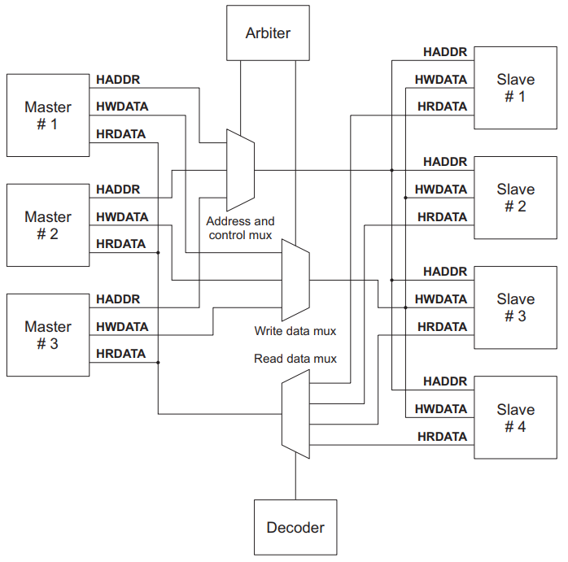

## 1. AHB组成部分
* AHB主设备(master)
  - 发起一次读写操作
  - 某一时刻只允许一个master使用总线
* AHB从设备(slave)
  - 响应一次读写操作
  - 通过地址映射来选择使用哪个slave
* AHB仲裁器(arbiter)
  - 允许某一个主设备控制总线
  - 在AMBA协议中没有定义仲裁算法
* AHB译码器(decoder)
  - 通过地址译码来决定选择哪个slave



<!-- more -->

## 2. AHB信号
| Name              | Source           | To                           | Desciption                                                                                                                                              |
| ----------------- | ---------------- | ---------------------------- | ------------------------------------------------------------------------------------------------------------------------------------------------------- |
| **HCLK**          | clock Source     | 各个module                   | 总线时钟                                                                                                                                                |
| **HRESETn**       | reset controller | 各个module                   | 总线复位                                                                                                                                                |
| **HADDR[31:0]**   | master           | decoder/mux to slave/arbiter | 32位系统地址总线                                                                                                                                        |
| **HTRANS[1:0]**   | master           | mux to slave                 | 当前传输类型: IDLE(00),BUSY(01),NONSEQ(10),SEQ(11)                                                                                                      |
| **HWRITE**        | master           | mux to slave                 | 0:读, 1:写                                                                                                                                              |
| **HSIZE[2:0]**    | master           | mux to slave                 | 指示当前传输的大小: 000(8bit),001(16bit),010(32bit),011(64bit)...                                                                                       |
| **HBURST[2:0]**   | master           | mux to slave/arbiter         | burst类型: single,incr,wrap                                                                                                                             |
| **HPROT[3:0]**    | master           | mux to slave                 | 保护机制，需要slave带有保护功能                                                                                                                         |
| **HWDATE[31:0]**  | master           | mux to slave                 | 写数据总线                                                                                                                                              |
| **HBUSREQx**      | master           | arbiter                      | 总线接入请求                                                                                                                                            |
| **HLOCKx**        | master           | arbiter                      | master requires locked access to the bus(no other master should be granted the bus until this signal is LOW)                                            |
| **HRDATE[31:0]**  | slave            | mux to master/arbiter        | 读数据总线                                                                                                                                              |
| **HREADY**        | slave            | mux to master/arbiter        | HREADY拉高表示一次传输完成，HREADY为低电平延长传输周期                                                                                                  |
| **HRESP[1:0]**    | slave            | mux to master/arbiter        | 传输状态: OKAY, ERROR, RETRY, SPLIT                                                                                                                     |
| **HSPLITx[15:0]** | slave            | arbiter                      | 告诉arbiter哪个master允许重新尝试一次split传输                                                                                                          |
| **HSELx**         | decoder          | slave                        | slave片选信号                                                                                                                                           |
| **HGRANTx**       | arbiter          | master                       | This signal indicates that bus master x is currently the highest priority master. A master gets access to the bus when both HREADY and HGRANTx are HIGH |
| **HMASTER[3:0]**  | arbiter          | 具有split功能的slave         | 指出哪个master正在进行传输，提供进行split的信息                                                                                                         |
| **HMASTLOCK**     | arbiter          | 具有split功能的slave         | 指出当前master正在进行一次锁定传输                                                                                                                      |

## 3. 基本传输
AHB传输有两个阶段：
* Address phase: 只有一个有效周期
* Data phase: 由HBURST信号决定需要几个有效周期

流水线传送：先是address phase，再是data phase。下一次address phase可以与上一次data phase在同一周期。

### 3.1 无等待周期的简单传输
```wavedrom
{signal: [
  {node: '.ABC.'},
  {name: 'HCLK', wave: 'P...'},
  {name: 'HADDR[31:0]', wave: 'x3xx', data: ['A']},
  {name: 'Control', wave: 'x3xx', data: ['Control']},
  {name: 'HWDATA[31:0]', wave: 'xx5x', data: ['Data(A)']},
  {name: 'HREADY', wave: 'xx1x'},
  {name: 'HRDATA[31:0]', wave: 'xx5x', data: ['Data(A)']},
  {node: '.DEF.'}
],
config: {hscale: 3},
edge: ['A-D', 'B-E', 'C-F', 'A<->B Address phase', 'B<->C Data phase']
}
```

### 3.2 需要等待两个周期的简单传输
slave通过拉低hready信号延长传输周期(协议规定最大不能超过16个周期)，**注意**：
* 对于写传输，master在延长周期内必须保持HWDATA数据稳定
* 对于读传输，slave在延长周期不需要提供有效的HRDATA
```wavedrom
{signal: [
  {node: '.AB..C.'},
  {name: 'HCLK', wave: 'P.....'},
  {name: 'HADDR[31:0]', wave: 'x3xxxx', data: ['A']},
  {name: 'Control', wave: 'x3xxxx', data: ['Control']},
  {name: 'HWDATA[31:0]', wave: 'xx5..x', data: ['Data(A)']},
  {name: 'HREADY', wave: 'xx0.1x'},
  {name: 'HRDATA[31:0]', wave: 'xxxx5x', data: ['Data(A)']},
  {node: '.DE..F.'}
],
config: {hscale: 3},
edge: ['A-D', 'B-E', 'C-F', 'A<->B Address phase', 'B<->C Data phase']
}
```

### 3.3 Pipeline传输
```wavedrom
{signal: [
  {name: 'HCLK', wave: 'P......'},
  {name: 'HADDR[31:0]', wave: 'x345.xx', data: ['A','B','C']},
  {name: 'Control', wave: 'x345.xx', data: ['Control(A)','Control(B)','Control(C)']},
  {name: 'HWDATA[31:0]', wave: 'xx34.5x', data: ['Data(A)','Data(B)','Data(C)']},
  {name: 'HREADY', wave: 'x1.01.x'},
  {name: 'HRDATA[31:0]', wave: 'xx3x45x', data: ['Data(A)','Data(B)','Data(C)']}
],
config: {hscale: 3}
}
```

## 4. burst传输
### 4.1 传输类型
| HTRANS[1:0] | Type   | Description                                                                                 |
| ----------- | ------ | ------------------------------------------------------------------------------------------- |
| 00          | IDLE   | master占用总线，但没有进行传输                                                              |
| 01          | BUSY   | master占用总线，但在burst传输过程中还没有准备好下一次传输，地址和控制信息必须反映下一次传输 |
| 10          | NONSEQ | 表明一次单个数据的传输或者一次burst传输的第一个数据，地址和控制信号与上一次传输无关         |
| 11          | SEQ    | 表明burst传输接下来的数据，**地址和上一次传输的地址是相关的，控制信息与上一次传输是相同的** |

### 4.2 burst类型
| HBURST[2:0] | Type   | Desciption                 |
| ----------- | ------ | -------------------------- |
| 000         | SINGLE | 单次传输                   |
| 001         | INCR   | 未定义长度incrementing传输 |
| 010         | WRAP4  | 4-beat wraping burst       |
| 011         | INCR4  | 4-beat incrementing burst  |
| 100         | WRAP8  | 8-beat wraping burst       |
| 101         | INCR8  | 8-beat incrementing burst  |
| 110         | WRAP16 | 16-beat wraping burst      |
| 111         | INCR16 | 16-beat incrementing burst |

### 4.3 未定义长度INCR传输
* INCR传输HADDR累加值与HSIZE有关，每次加2^HSIZE^
* Burst传输不能跨越1K边界，即到达1K边界需要用NONSEQ发起一次新的传输

:::hint info 
**:question:思考：为什么burst传输不能跨越1K边界？**
ARM的回答：The 1KB restriction you refer to is not a restriction on maximum slave size but a constraint within AHB that says that a burst must not cross a 1KB boundary. The limit is designed to prevent bursts crossing from one device to another and to give a reasonable trade-off between burst size and efficiency. In practise, this means that a master must ALWAYS break a burst that would otherwise cross the 1KB boundary and restart it with a non-sequential transfer.
:::

```wavedrom
{signal: [
  {name: 'HCLK', wave: 'P.......'},
  {name: 'HTRANS[1:0]', wave: 'x33444xx', data: ['NONSEQ','SEQ','NONSEQ','SEQ','SEQ']},
  {name: 'HADDR[31:0]', wave: 'x33444xx', data: ['0x20','0x22','0x5C','0x60','0x64']},
  {name: 'HBURST[2:0]', wave: 'x3.4..xx', data: ['INCR','INCR']},
  {name: 'HSIZE[2:0]',  wave: 'x3.4..xx', data: ['001','010']},
  {name: 'HWDATA[31:0]', wave: 'xx33444x', data: ['Data(0x20)','Data(0x22)','Data(0x5C)','Data(0x60)','Data(0x64)']},
  {name: 'HREADY', wave: 'x1.....x'},
  {name: 'HRDATA[31:0]', wave: 'xx33444x', data: ['Data(0x20)','Data(0x22)','Data(0x5C)','Data(0x60)','Data(0x64)']}
],
foot: {text: ['tspan',{class: 'h4'}, '图4.3.1 未定义长度INCR传输']},
config: {hscale: 3}
}
```

```wavedrom
{signal: [
  {name: 'HCLK', wave: 'P........'},
  {name: 'HTRANS[1:0]', wave: 'x522522xx', data: ['NONSEQ','SEQ','SEQ','NONSEQ','SEQ','SEQ']},
  {name: 'HADDR[31:0]', wave: 'x522522xx', data: ['0x3F4','0x3F8','0x3FC','0x400','0x404','0x408']},
  {name: 'HBURST[2:0]', wave: 'x2.....xx', data: ['INCR']},
  {name: 'HSIZE[2:0]',  wave: 'x2.....xx', data: ['010']},
  {name: 'HWDATA[31:0]', wave: 'xx522522x', data: ['Data(0x3F4)','Data(0x3F8)','Data(0x3FC)','Data(0x400)','Data(0x404)','Data(0x408)']},
  {name: 'HREADY', wave: 'x1......x'},
  {name: 'HRDATA[31:0]', wave: 'xx522522x', data: ['Data(0x3F4)','Data(0x3F8)','Data(0x3FC)','Data(0x400)','Data(0x404)','Data(0x408)']}
],
foot: {text: ['tspan',{class: 'h4'}, '图4.3.2 未定义长度INCR跨1K边界']},
config: {hscale: 3}
}
```

### 4.4 WRAP传输
::: hint info 
**:question:思考：如何确定WRAP边界？**
wrap的边界与HSIZE和HBURST都有关系，对于WRAP4来说，HADDR[HSIZE+1:HSIZE]==2'b11就是边界；对于WRAP8来说，HADDR[HSIZE+2:HSIZE]==2'b111就是边界，同理适用于WRAP16。
**假如**：HSIZE=3'b010时，HADDR起始地址为0x48
**当HBURST为WRAP4时**，HADDR依次为0x48 -> 0x4C -> 0x40 -> 0x44(对应的HADDR[3:2]依次为2'b10 -> 2'b11 -> 2'b00 -> 2'b01)
**当HBURST为WRAP8时**，HADDR依次为0x48 -> 0x4C -> 0x50 -> 0x54 -> 0x58 -> 0x5C -> 0x40 -> 0x44(对应的HADDR[4:2]依次为3'b010 -> 3'b011 -> 3'b100 -> 3'b101 -> 3'b110 -> 3'b111 -> 3'b000 -> 3'b001)
:::


```wavedrom
{signal: [
  {name: 'HCLK', wave: 'P......'},
  {name: 'HTRANS[1:0]', wave: 'x2222xx', data: ['NONSEQ','SEQ','SEQ','SEQ']},
  {name: 'HADDR[31:0]', wave: 'x2222xx', data: ['0x48','0x4C','0x40','0x44']},
  {name: 'HBURST[2:0]', wave: 'x2...xx', data: ['WRAP4']},
  {name: 'HSIZE[2:0]',  wave: 'x2...xx', data: ['010']},
  {name: 'HWDATA[31:0]', wave: 'xx2222x', data: ['Data(0x48)','Data(0x4C)','Data(0x40)','Data(0x44)']},
  {name: 'HREADY', wave: 'x1....x'},
  {name: 'HRDATA[31:0]', wave: 'xx2222x', data: ['Data(0x48)','Data(0x4C)','Data(0x40)','Data(0x44)']}
],
foot: {text: ['tspan',{class: 'h4'}, '图4.4.1 WRAP4传输']},
config: {hscale: 3}
}
```

## 5. 总结
* slave短时间内无法响应：将HREADY拉低
* slave长时间无法响应：插入SPIT/RETRY
* master不能传输，插入BUSY
* 总线上如果只有一个master，可以使用AHB lite协议，即没有arbiter，不支持retry和split响应
* AHB中hready的含义
  - 对于slave来说,进来的hready_i代表的是bus上的状态低就表示bus被人(可能是他自己)使用着,hready_o代表它自身的状态,低代表它要占用bus
  - 对于arbiter来说,从slave进来的hready_i代表各个slave占用bus的状态,返回给slave的hready是所有的hready_i做and运算之后的结果,同时这个也返回给master
  - 对于master来说,hready_i拉低代表bus忙,不能使用
