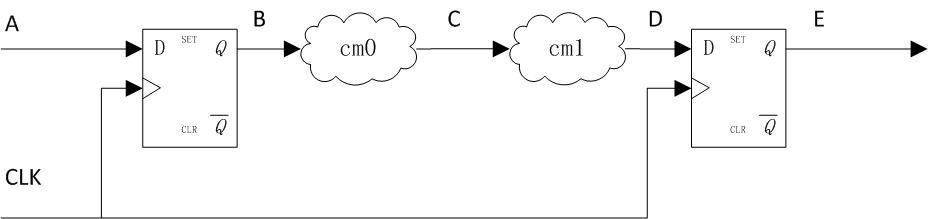
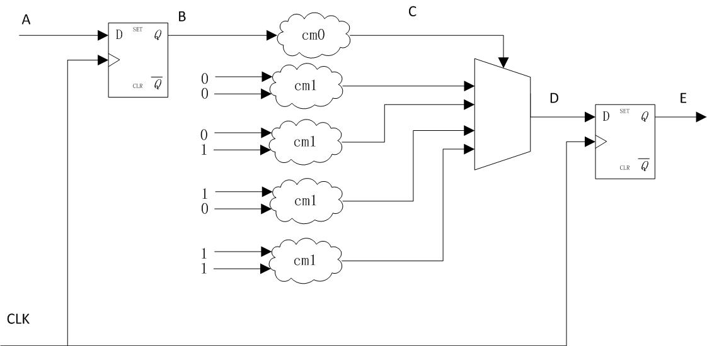

## 时序优化题
问：CLK->Q的时间为0.5ns，组合逻辑cm0、cm1延时均为7ns，在不增加流水线数目(pipeline stage)的前提下，怎么修改电路，才能让CLK达到100MHZ？(提示：C宽为2bit)

<!-- more -->

答：放置4个cm1，分别用定值00、01、10、11作为输入，在D前放置4-to-1 Mux，将cm0输出作为选择信号，目的是将cm1的7ns替换为Mux Cell的延时。(逻辑复制，面积换时间)

