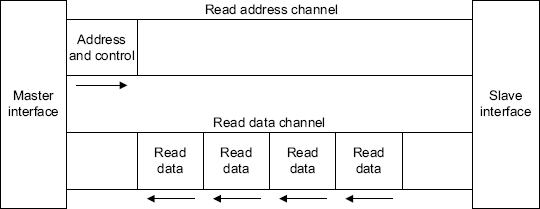
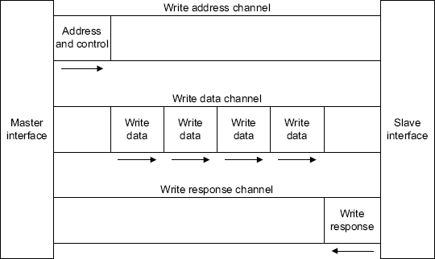

# AXI协议详解

## 相较于AXI3，AXI4新增内容：
* support for burst lengths up to 256 beats
* Quality of Service (QoS) signaling
* support for multiple region interfaces
* updated write response requirements
* updated AWCACHE and ARCACHE signaling details
* additional information on Ordering requirements
* details of optional User signaling
* removal of locked transactions
* removal of write interleaving

| 信号       | Source       | Desciption                                      |
| ---------- | ------------ | ----------------------------------------------- |
| ACLK       | clock Source | 全局时钟                                        |
| ARESETn    | reset Source | 全局复位                                        |
| 写地址通道 |              |                                                 |
| AWID       | master       | 写地址ID                                        |
| AWADDR     | master       | 写地址                                          |
| AWLEN      | master       | burst长度(**AXI3与AXI4不同**)                   |
| AWSIZE     | master       | burst中一次传输数据的大小                       |
| AWBURST    | master       | burst类型，FIXED(00), INCR(01), WRAP(10)        |
| AWLOCK     | master       | lock类型(**AXI3与AXI4不同**)                    |
| AWCACHE    | master       | memory类型                                      |
| AWPROT     | master       | 保护类型                                        |
| AWQOS      | master       | Quality of Service(**AXI4新增**)                |
| AWREGION   | master       | 区域标识(**AXI4新增**)                          |
| AWUSER     | master       | User signal(**AXI4新增**)                       |
| AWVALID    | master       | 写地址有效                                      |
| AWREADY    | slave        | slave准备好接受地址和控制信息标志               |
| 写数据通道 |              |                                                 |
| WID        | master       | 写ID tag, WID与AWID必须匹配(**AXI4删除**)       |
| WDATA      | master       | 写数据                                          |
| WSTRB      | master       | 写阀门,WSTRB[n]标示的区间为WDATA[(8*n)+7:(8*n)] |
| WLAST      | master       | burst中最后一笔传输标志                         |
| WUSER      | master       | User signal(**AXI4新增**)                       |
| WVALID     | master       | 写数据有效                                      |
| WREADY     | slave        | slave准备好接受数据标志                         |
| 写响应通道 |              |                                                 |
| BID        | slave        | 写响应ID tag, BID必须与AWID匹配                 |
| BRESP      | slave        | 写响应                                          |
| BUSER      | slave        | User signal(**AXI4新增**)                       |
| BVALID     | slave        | 写响应有效                                      |
| BREADY     | master       | master准备好接受写响应标志                      |
| 读地址通道 |              |                                                 |
| ARID       | master       | 读地址ID                                        |
| ARADDR     | master       | 读地址                                          |
| ARLEN      | master       | burst长度(**AXI3与AXI4不同**)                   |
| ARSIZE     | master       | burst中一次传输数据的大小                       |
| ARBURST    | master       | burst类型                                       |
| ARLOCK     | master       | lock类型(**AXI3与AXI4不同**)                    |
| ARCACHE    | master       | memory类型                                      |
| ARPROT     | master       | 保护类型                                        |
| ARQOS      | master       | Quality of Service(**AXI4新增**)                |
| ARREGION   | master       | 区域标识(**AXI4新增**)                          |
| ARUSER     | master       | User signal(**AXI4新增**)                       |
| ARVALID    | master       | 读地址有效                                      |
| ARREADY    | slave        | slave准备好接受地址和控制信息标志               |
| 读数据通道 |              |                                                 |
| RID        | slave        | 读ID tag,RID必须与ARID匹配                      |
| RDATA      | slave        | 读数据                                          |
| RRESP      | slave        | 读响应                                          |
| RLAST      | slave        | burst中最后一笔传输标志                         |
| RUSER      | slave        | User signal(**AXI4新增**)                       |
| RVALID     | slave        | 读数据有效                                      |
| RREADY     | master       | master准备好接受读数据标志                      |
