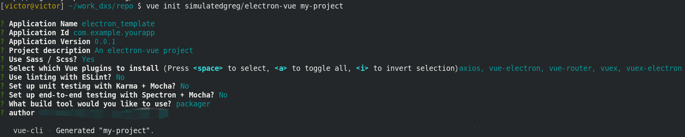

## electron-vue环境配置

工作环境centos8，切换到root用户安装npm、yarn、vue_cli

```bash
yum install npm
npm install yarn -g
npm install vue_cli -g
```

切换到工作用户，使用淘宝源下载库更快速

```bash
npm config set registry=http://registry.npm.taobao.org
yarn config set registry https://registry.npm.taobao.org
yarn config set sass_binary_site https://npm.taobao.org/mirrors/node-sass/
```

使用`npm config list`和`yarn config list`查看切换源是否成功

## 初始化electron_vue项目

```bash
#下载模板
vue init simulatedgreg/electron-vue my-project
#下载依赖库
yarn
#运行
yarn run dev
#发行
yarn build
```

在开发环境搭建的时候需要注意下面俩点：

1. electron-vue 虽然说使用npm也可以下载依赖，但是最好不要用，在我这个版本测试的时候，使用npm下载依赖打包时有问题，总而言之，就是用yarn就好了。
2. Eslint选择no，testing都选择no，其他默认即可
3. 选择打包工具的时候，选择electron packager，不要选electron builder，builder在打包的时候回从aws上面下载资源，但是我这即使使用了某些不可说的工具，也下载不下来这些资源，会导致打包失败。



## 安装Element-UI环境

```bash
npm install element-ui -S
```

在`src/renderer/main.js`添加

```js
// element-ui
import ElementUI from 'element-ui'
import 'element-ui/lib/theme-chalk/index.css'
Vue.use(ElementUI)
```

修改`src/render/components/LandingPage.vue`, 下面这一段就是从element官网copy的一段代码, 然后我把它精简了一下, 下面这段代码就当做我们演示element

```vue
<template>
  <el-container style="height: 500px; border: 1px solid #eee">
  <el-aside width="200px" style="background-color: rgb(238, 241, 246)">
    <el-menu :default-openeds="['1', '3']">
      <el-submenu index="1">
       <el-menu-item index="1-1">选项1</el-menu-item>
      </el-submenu>
    </el-menu>
  </el-aside>
  
  <el-container>
    <el-header style="text-align: right; font-size: 12px">
    </el-header>
    <el-main>
      <el-table :data="tableData">
        <el-table-column prop="date" label="日期" width="140"></el-table-column>
        <el-table-column prop="name" label="姓名" width="120"></el-table-column>
        <el-table-column prop="address" label="地址"></el-table-column>
      </el-table>
    </el-main>
  </el-container>
</el-container>
</template>

<script>
   export default {
    data() {
      const item = {
        date: '2016-05-02',
        name: '王小虎',
        address: '上海市普陀区金沙江路 1518 弄'
      };
      return {
        tableData: Array(5).fill(item)
      }
    }
  };
</script>

<style>
  .el-header {
    background-color: #B3C0D1;
    color: #333;
    line-height: 60px;
  }
  
  .el-aside {
    color: #333;
  }
</style>
```

然后执行`yarn run dev`会发现el-table这个表格组件好像很特殊！它怎么都显示不出来，除了它以外其他的控件都能正常显示，根据electron-vue作者自己的回复，element-ui需要加入到白名单里面，需要修改`.electron-vue/webpack.renderer.config.js`

将：

```js
let whiteListedModules = ['vue']
```

修改为：

```js
let whiteListedModules = ['vue', 'element-ui']
```