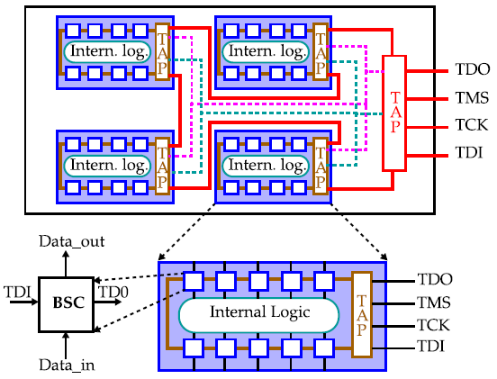
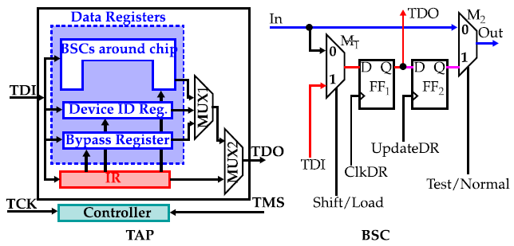
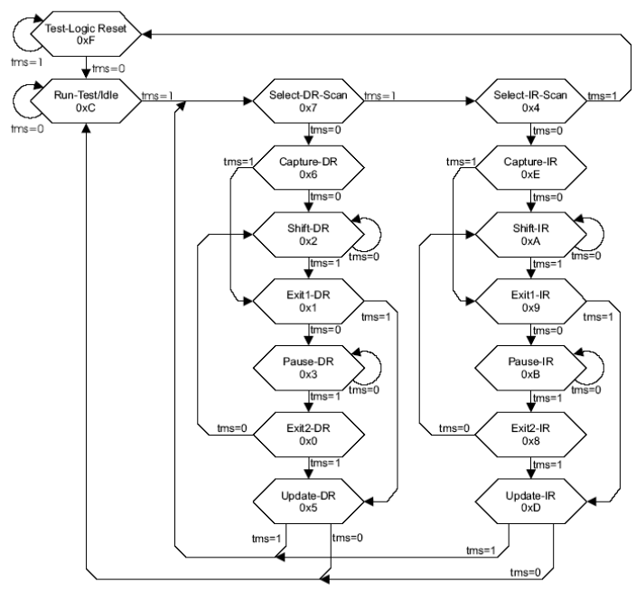
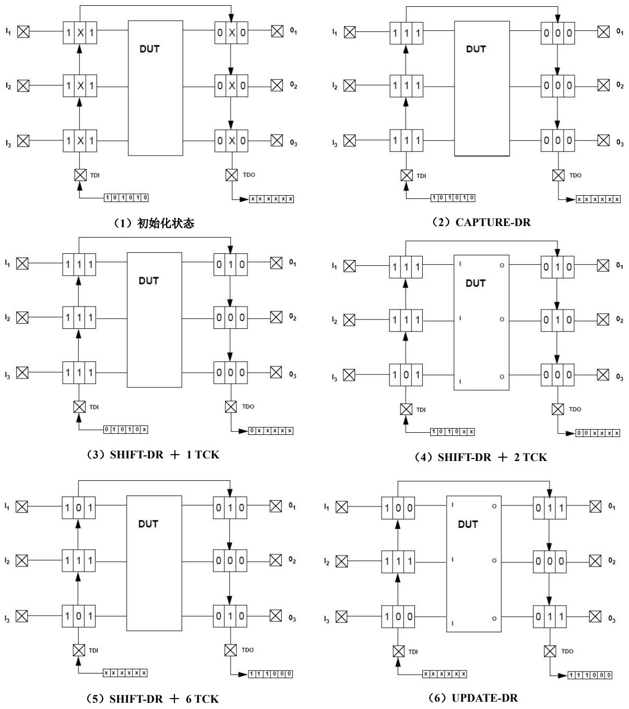

# jtag工作原理

## 1. 边界扫描
在JTAG调试当中，边界扫描（Boundary-Scan）是一个很重要的概念。边界扫描技术的基本思想是在靠近芯片的输入输出管脚上增加一个移位寄存器单元。因为这些移位寄存器单元都分布在芯片的边界上（周围），所以被称为边界扫描寄存器（Boundary-Scan Register Cell）。当芯片处于调试状态的时候，这些边界扫描寄存器可以将芯片和外围的输入输出隔离开来。通过这些边界扫描寄存器单元，可以实现对芯片输入输出信号的观察和控制。对于芯片的输入管脚，可以通过与之相连的边界扫描寄存器单元把信号（数据）加载倒该管脚中去；对于芯片的输出管脚，也可以通过与之相连的边界扫描寄存器“捕获”（CAPTURE）该管脚上的输出信号。在正常的运行状态下，这些边界扫描寄存器对芯片来说是透明的，所以正常的运行不会受到任何影响。这样，边界扫描寄存器提供了一个便捷的方式用以观测和控制所需要调试的芯片。另外，芯片输入输出管脚上的边界扫描（移位）寄存器单元可以相互连接起来，在芯片的周围形成一个边界扫描链（Boundary-Scan Chain）。一般的芯片都会提供几条独立的边界扫描链，用来实现完整的测试功能。边界扫描链可以串行的输入和输出，通过相应的时钟信号和控制信号，就可以方便的观察和控制处在调试状态下的芯片。

利用边界扫描链可以实现对芯片的输入输出进行观察和控制。下一个问题是：如何来管理和使用这些边界扫描链？对边界扫描链的控制主要是通过TAP(Test Access Port) Controller来完成的。在下一节，我们一起来看看TAP是如何工作的。

<!-- more -->

## 2. TAP(Test Access Port)
在上一节，我们已经简单介绍了边界扫描链，而且也了解了一般的芯片都会提供几条边界扫描链，用来实现完整的测试功能。下面，我将逐步介绍如何实现扫描链的控制和访问。

在IEEE 1149.1标准里面，寄存器被分为两大类：数据寄存器(DR－Data Register)和指令寄存器(IR－Instruction Register)。边界扫描链属于数据寄存器中很重要的一种。边界扫描链用来实现对芯片的输入输出的观察和控制。而指令寄存器用来实现对数据寄存器的控制，例如：在芯片提供的所有边界扫描链中，选择一条指定的边界扫描链作为当前的目标扫描链，并作为访问对象。下面，让我们从TAP(Test Access Port)开始。

### 2.1 接口信号定义

TAP是一个通用的端口，通过TAP可以访问芯片提供的所有数据寄存器（DR）和指令寄存器（IR）。对整个TAP的控制是通过TAP Controller来完成的。TAP总共包括5个信号接口TCK、TMS、TDI、TDO和TRST ：其中4个是输入信号接口和另外1个是输出信号接口。一般，我们见到的开发板上都有一个JTAG接口，该JTAG接口的主要信号接口就是这5个。下面，我先分别介绍这个5个接口信号及其作用。

* **Test Clock Input (TCK)**
TCK为TAP的操作提供了一个独立的、基本的时钟信号，TAP的所有操作都是通过这个时钟信号来驱动的。TCK在IEEE 1149.1标准里是**强制要求**的。
* **Test Mode Selection Input (TMS)**
TMS信号用来控制TAP状态机的转换。通过TMS信号，可以控制TAP在不同的状态间相互转换。TMS信号在TCK的上升沿有效。TMS在IEEE 1149.1标准里是**强制要求**的。
* **Test Data Input (TDI)**
TDI是数据输入的接口。所有要输入到特定寄存器的数据都是通过TDI接口一位一位串行输入的（由TCK驱动）。TDI在IEEE 1149.1标准里是**强制要求**的。
* **Test Data Output (TDO)**
TDO是数据输出的接口。所有要从特定的寄存器中输出的数据都是通过TDO接口一位一位串行输出的（由TCK驱动）。TDO在IEEE 1149.1标准里是**强制要求**的。
* **Test Reset Input (TRST)**
TRST可以用来对TAP Controller进行复位（初始化）。不过这个信号接口在IEEE 1149.1标准里是可选的，并**不是强制要求的**。因为通过TMS也可以对TAP Controller进行复位（初始化）。

### 2.2 指令寄存器、公共指令以及数据寄存器
在IEEE 1149.1标准当中，规定了一些指令寄存器、公共指令和相关的一些数据寄存器。对于特定的芯片而言，芯片厂商都一般都会在IEEE 1149.1标准的基础上，扩充一些私有的指令和数据寄存器，以帮助在开发过程中进行进行方便的测试和调试。在这一部分，我将简单介绍IEEE 1149.1规定的一些常用的指令及其相关的寄存器。

**指令寄存器：**
指令寄存器允许特定的指令被装载到指令寄存器当中，用来选择需要执行的测试，或者选择需要访问的测试数据寄存器。每个支持JTAG调试的芯片必须包含一个指令寄存器。

**BYPASS指令和Bypass寄存器：**
Bypass寄存器是一个一位的移位寄存器，通过BYPASS指令，可以将bypass寄存器连接到TDI和TDO之间。在不需要进行任何测试的时候，将bypass寄存器连接在TDI和TDO之间，在TDI和TDO之间提供一条长度最短的串行路径。这样允许测试数据可以快速的通过当前的芯片送到开发板上别的芯片上去。

**IDCODE指令和Device Identification 寄存器：**
Device identification寄存器中可以包括生产厂商的信息，部件号码，和器件的版本信息等。使用IDCODE指令，就可以通过TAP来确定器件的这些相关信息。例如，ARM MULTI-ICE可以自动识别当前调试的是什么片子，其实就是通过IDCODE指令访问Device Identification寄存器来获取的。

**INTEST指令和Boundary-Scan 寄存器：**
Boundary-Scan寄存器就是我们前面例子中说到的边界扫描链，一般一个芯片内部有多个边界扫描链。通过边界扫描链，可以进行部件间的连通性测试。当然，更重要的是可以对测试器件的输入输出进行观测和控制，以达到测试器件的内部逻辑的目的。INTEST指令是在IEEE 1149.1标准里面定义的一条很重要的指令：结合边界扫描链，该指令允许对开发板上器件的系统逻辑进行内部测试。在ARM JTAG调试当中，这是一条频繁使用的测试指令。

我们前面说过，寄存器分为两大类：指令寄存器和数据寄存器。在上面提到的Bypass寄存器、Device Identification寄存器和Boundary-scan寄存器（边界扫描链），都属于数据寄存器。在调试当中，边界扫描寄存器（边界扫描链）最重要，使用的也最为频繁。

事实上，通过TAP接口，对数据寄存器（DR）进行访问的一般过程是：
* 通过指令寄存器（IR），选定一个需要访问的数据寄存器(bypass,ID,Boundary-scan)；
* 把选定的数据寄存器连接到TDI和TDO之间；
* 由TCK驱动，通过TDI，把需要的数据输入到选定的数据寄存器当中去；同时把选定的数据寄存器中的数据通过TDO读出来。

### 2.3 TAP状态机

接下来，让我们一起来了解一下TAP的状态机。TAP的状态机如图1所示，总共有16个状态。在TCK的驱动下，从当前状态到下一个状态的转换是由TMS信号决定。

这个状态机看似很复杂，其实理解以后会发现这个状态机其实很直接、很简单。观察上图，我们可以发现，除了Test-Logic Reset和Test-Run/Idle状态外，其他的状态有些类似。例如Select-DR-Scan和Select-IR-Scan对应，Capture-DR和Capture-IR对应，Shift-DR和Shift-IR对应，等等。在这些对应的状态中，DR表示Data Register，IR表示Instruction Register。记得我们前面说过吗，寄存器分为两大类，数据寄存器和指令寄存器。其实标识有DR的这些状态是用来访问数据寄存器的，而标识有IR的这些状态是用来访问指令寄存器的。

让我们来看一个更直观的例子。现在假设，TAP Controller 现在处在 Run-Test/Idle 状态，指令寄存器当中已经成功的写入了一条新的指令，该指令选定的是一条长度为6的边界扫描链。下面让我们来看看实际如何来访问这条边界扫描链。下图所示的是测试芯片及其被当前指令选定的长度为6的边界扫描链。由下图可以看出，当前选择的边界扫描链由6个边界扫描移位寄存器单元组成，并且被连接在TDI和TDO之间。TCK 时钟信号与每个边界扫描移位寄存器单元相连。每个时钟周期可以驱动边界扫描链的数据由TDI到TDO的方向移动一位，这样，新的数据可以通过 TDI 输入一位，边界扫描链的数据可以通过 TDO 输出一位。经过6个时钟周期，就可以完全更新边界扫描链里的数据，而且可以将边界扫描链里捕获的6位数据通过TDO全部移出来。

图(1)表示了芯片和边界扫描链的初始化状态，在测试状态下，芯片的外部输入和输出被隔离开了，芯片的输入和输出可以通过相应的边界扫描链来观察和控制。在图(1)中，扫描链里的每个移位寄存器单元的数据是不确定的，所以在图中用X表示，整个扫描链里的数据序列是XXXXXX。要从TDI输入到测试芯片上的数据序列是：101010. 同时要从TDO得到芯片相应管脚上的状态。现在TAP Controller从Run-Test/Idle状态经过Select-DR-Scan状态进入到Capture-DR状态，在 Capture-DR 状态当中，在一个TCK时钟的驱动下，芯片管脚上的信号状态全部被捕获到相应的边界扫描移位寄存器单元当中去，如图(2)所示。从图(2)中我们可以看出，在进入 Capture-DR 状态后，经过一个 TCK 时钟周期，现在扫描链中的数据序列变成了：111000. 在数据捕获完成以后，从Capture-DR状态进入到Shift-DR状态。在Shift-DR状态中，我们将通过6个TCK时钟周期来把新的数据序列（101010）通过 TDI 输入到边界扫描链当中去；同时，将边界扫描链中捕获的数据序列（111000）通过 TDO 输出来。在进入到 Shift-DR 状态后，每经过一个 TCK 时钟驱动，边界扫描链从 TDO 输出一位数据；同时，从 TDI 接收一位新的数据。图(3)所示的是在 Shift-DR状态下，1 个 TCK 时钟周期后的扫描链的变化。图(4)所示的是在Shift-DR状态下，2个TCK时钟周期后的扫描链的变化。此时，扫描链已经从TDI串行得到了两位新数据，从TDO也串行输出了两位数据。在TCK时钟的驱动下，这个过程一直继续下去。图(5)所示的是在经过6 个 TCK 时钟周期以后扫描链的情况。从图(5)中我们可以看到：边界扫描链当中已经包含了新的数据序列：101010. 在TDO端，经过6个TCK时钟驱动以后，也接收到了在Capture-DR状态下捕获到的数据序列：111000. 到目前为止，虽然扫描链当中包含了新的数据序列：101010，但测试芯片的管脚上的状态还是保持为：111000. 下一步，需要更新测试芯片相应管脚上的信号状态。要实现更新，TAP Controller 从 Shift-DR 状态，经过 Exit1-DR 状态，进入到 Update-DR 状态。在 Update-DR 状态中，经过一个周期的 TCK 时钟驱动，边界扫描链中的新数据序列将被加载到测试芯片的相应管脚上去，如图(6)所示。从图(6)可以看出，测试芯片的状态已经被更新，相应管脚上的状态序列已经从111000变为101010. 最后从 Update-DR状态回到 Run-Test/Idle 状态，完成对选定的边界扫描链的访问。

**关于Pause-DR/Pause-IR状态**
这两个状态是暂停状态，比如说我们要通过32bit的总线从一个48长度的扫描链中读出相应管脚的状态，我们需要读两次才能将48bit的扫描链状态读出来，先经过32个TCK时钟读出高32bit的状态，然后转到Pause-DR状态等待总线读响应，响应完成后再进入Shift-DR经过16个TCK时钟读出低16bit数据。
