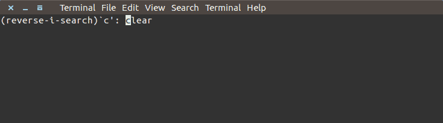
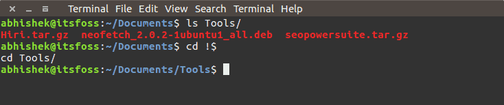
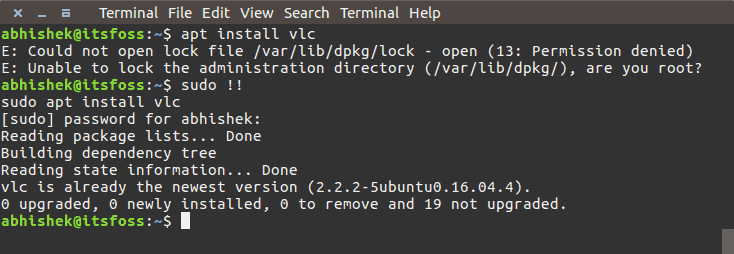

# Linux小技巧

## 1. 一行执行多条命令

* 分号 ： 顺序地独立执行各条命令， 彼此之间不关心是否失败， 所有命令都会执行。
* &&   ： 顺序执行各条命令， 只有当前一个执行成功时候， 才执行后面的。
* ||   ： 顺序执行各条命令， 只有当前面一个执行失败的时候， 才执行后面的。

## 2. 搜索已经使用的命令 `ctrl+r`

先按`ctrl+r`，然后输入要搜索的字符串即可。

## 3. 读压缩后的文件

读log文件常用的命令有`cat`、`less`、`tail`、`grep`等，但如果文件被压缩了，这些命令读出来的就是乱码，我们可以使用`zcat`、`zless`、`zgrep`等命令读取压缩的文本文件。

## 4. 获取上次命令的last item(`!$`)

可以使用`!$`获取上次命令的选项

## 5. 获取上次命令(`!!`)

可以使用`!!`获取上次命令

