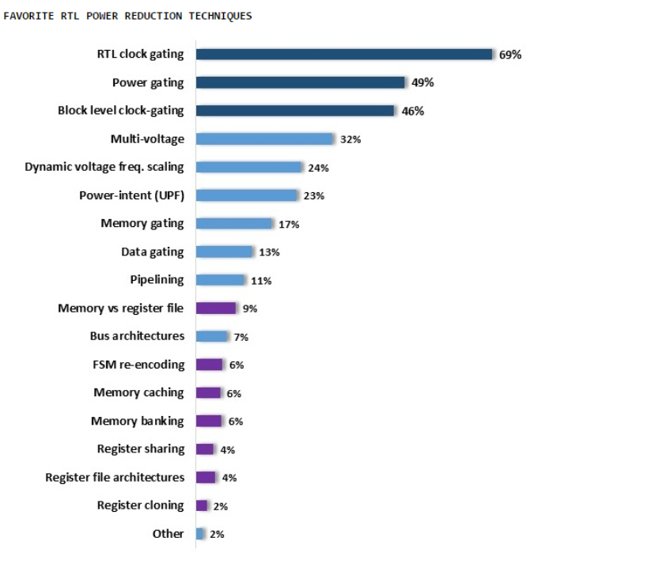

论坛里面讨论low power RTL前端设计的帖子好像不多，许多大牛的书上来就谈工艺，半导体结构，让我高山仰止，但也只能心向往之(实在有些看不懂)。

工艺的提升带来的收益可能远比RTL深度优化高，如TSMC 40LP vs TSMC 28HPC+, 后者基本上比前者面积小一半，速度快一倍，dynamic power小40 ~ 50%，代价是leakage高3~4倍。在老工艺上如何绞尽脑汁优化设计，可能也很难达到这种效果。

但作为前端RTL designer, 一旦工艺选定，我们只能在自己的一亩三分地里面做到最好，本帖就此抛砖迎玉，结合自己的工作经验讨论下low power RTLdesign, 挖个坑，希望坛子里的大牛一起帮忙填坑

刚入行做design时，考虑的是Area 和 speed，近些年来，power变成了越来越重要的指标，有时候更是牺牲Area和speed来换取power的收益，毕竟有些领域, 电池容量是很难增大的。

有人做过大体统计，降低功耗的方法和收益大体如下，对于前端RTL 设计，最好用的还是clock gating, 收益最显巨，代价最小，
其他方法也能有可观的收益，具体还的依靠具体应用场景分析。

<!--more-->

Power 主要消耗在 

1) combinational logic

2) sequential logic

3) memory 

4) clock network

下面我将就下面几个方面展开讨论,

**1. Improve clock gating efficiency.**

- Block level clock gating.

- RTL clock gating. (重点)

**2. Reduce data toggle rate.**

- fifovs PIPE

- FSM coding style

- Unnecessary reset.

**3. Refine Memory Selection.**

- Area power balance

- I/F bitwidth selection.

- Depth selection.

**4. Reduce memory accessing**

- Address caching.

**5. Reduce logic size**

- Logic sharing.

- Logic balancing

- Divider optimization.

- Reduce pipe line length

- Hardmacro vs Register

- Reduce bitwidth

- Async reset vs non-async-reset.

**6. Misunderstanding**

（未完待续）