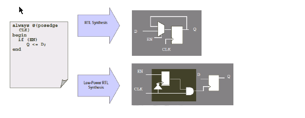

## 1. block level clock gating

如果某个模块或者功能可以打开或关闭，且logic相对独立，则可以在这部分logic的时钟上加手动插入一个ICG，用模块是能控制ICG的开关，这样能最大限度的提升gating效率。

1. ICG最好选取驱动能力较大的，以便于驱动足够多的DFF。

2. ICG建议加一个wrapper,这样当需要替换其他工艺时，只需要将wrapper里的instance 换掉。

3. 综合时对此类ICG设置don’t touch

<!--more-->


## 2. RTL clock gating

Lowpower RTL综合的精髓就是把本该综合在D端的enable信号，综合到CLK端，这样只有enable有效才能释放一个clk使得D端数据传递到Q端。当D超过一定bit数，通常认定>=4bit能节省power, 为了达到这种效果，寄存器的赋值一定是条件赋值，示范代码和电路如下：




Low power RTL 理想代码结构：

```verilog
always@(posedge clk or negedge rstn) begin
    if(!rstn)begin
        Q<= 'h0;
    end
    else if (condition_1)begin
        Q<= D_1;
    end
    //other condition 2, 3, 4 …
	else begin
		Q<= Q;  //better to remove this assignment, then data willbe kept.
	end
end
```


错误代码的示例, 如果不管在什么情况下，总有D值需要打到Q, 使得即使综合出来ICG， 该ICG也不能关断。错误远不止下面几种，if/else if/else, case/default 等等

### 没有赋值条件

```verilog
always@(posedge clk) begin //”if-else”hierarchy 0, default is “else” block
	Q <= D;                //Error: no condition for Data assignment.
end
```

### else 赋值

```verilog
always@(posedge clk or negedge rstn) begin  //hier0
    if(!rstn) begin                       //hier1 “if” block
		Q <=’h0;   
    end 
    else begin                      //hier1 “else” block
       Q<=D;                            //Error: no condition for Dataassignment.
   	end
end
```

### 多级条件中的else

```verilog
always@(posedge clk or negedge rstn) begin  //hier0
    if(!rstn) begin                         //hier1 “if” block
		Q <=’h0;  
	end 
    else if(condition1) begin           //hier1 “else if” block
		if(condition1_1) begin           //hier2“if”block
			Q<=D1_1;
		end 
       else begin                  //hier2“else” block
			Q<=D1_2;                //not report error, as it is in “else if”block.
		end
	end 
    else begin                   //hier1 “else” block
		if(conditon2_1) begin     //hier2“if” block
			Q<=D2_1;
		end 
       else begin                //hier2“else” block, in hier1 “else” block
			Q<=D2_2;              //Error: no condition for Data assignment.
		end
	end
end
```

下面这个例子不会报错

```verilog
always@(posedge clk or negedge rstn) begin  //hier0
	if(!rstn)begin                          //hier1 “if” block
		Q <=’h0;   
	end
    else if(condition1) begin              //hire1 “else if” block
		Q<=Q;                               //”Q<=Q”ensure ICG insertion
	end
    else begin                             //hier1 “else” block
		Q<=D;                               //Not reportERROR as “Q<=Q” in “else if”.
	end
end
```

