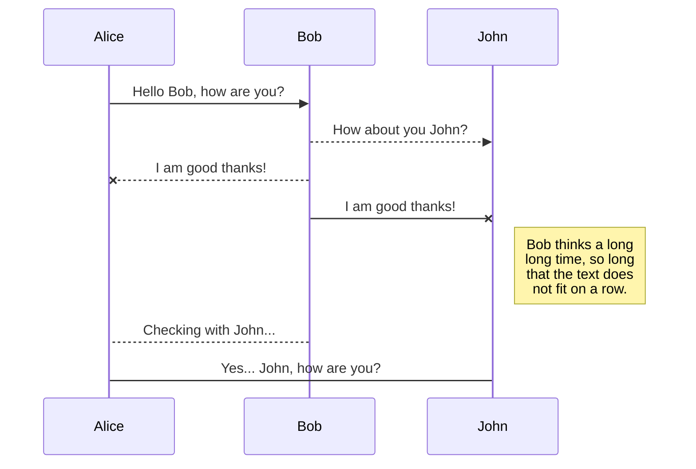
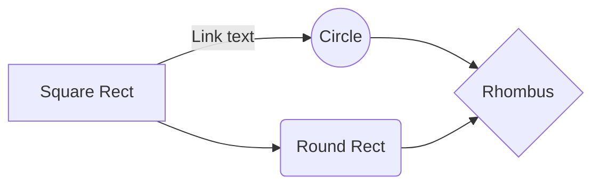

This is an H1
=============

This is an H2
-------------

### 字符效果和横线等

----

~~删除线~~ <s>删除线（开启识别HTML标签时）</s>
*斜体字*      _斜体字_
**粗体**  __粗体__
***粗斜体*** ___粗斜体___
==高亮==

### markdown-it-kbd
[[Ctrl+C]]

### markdown-it-attrs
* success background {.bg-success}
* info background {.bg-info}
* warning background {.bg-warning}
* danger background {.bg-danger}
* ==red=={.bg-red} ==red dark=={.bg-red-dark} ==green=={.bg-green} ==blue=={.bg-blue} ==orange=={.bg-orange} ==pink=={.bg-pink}
* ::red::{.red} ::blue::{.blue} ::green::{.green} ::purple::{.purple} ::pink::{.pink}
* ::波浪线红::{.wavy-red} ::波浪绿线::{.wavy-green} ::波浪线粉::{.wavy-pink}

a=b=

上标：X<sub>2</sub>   X~2~
下标：O<sup>2</sup>   O^2^

**脚注**
Content  [^1]

[^1]: 我是脚注

<!-- more -->

**缩写(同HTML的abbr标签)**

> 即更长的单词或短语的缩写形式，前提是开启识别HTML标签时，已默认开启

The <abbr title="Hyper Text Markup Language">HTML</abbr> specification is maintained by the <abbr title="World Wide Web Consortium">W3C</abbr>.

### 引用 Blockquotes

> 引用文本 Blockquotes

引用的行内混合 Blockquotes

> 引用：如果想要插入空白换行`即<br />标签`，在插入处先键入两个以上的空格然后回车即可，[普通链接](http://localhost/)。
> * 苹果
> * 香蕉

### 锚点与链接 Links

[普通链接](http://localhost/)

[普通链接带标题](http://localhost/ "普通链接带标题")

直接链接：<https://github.com>

[锚点链接][anchor-id]

[anchor-id]: http://www.this-anchor-link.com/

[mailto:test.test@gmail.com](mailto:test.test@gmail.com)

GFM a-tail link @pandao  邮箱地址自动链接 test.test@gmail.com  www@vip.qq.com

> @pandao

### 多语言代码高亮 Codes

#### 行内代码 Inline code

执行命令：`npm install marked`

#### 缩进风格

即缩进四个空格，也做为实现类似 `<pre>` 预格式化文本 ( Preformatted Text ) 的功能。

    <?php
        echo "Hello world!";
    ?>

预格式化文本：

    | First Header  | Second Header |
    | ------------- | ------------- |
    | Content Cell  | Content Cell  |
    | Content Cell  | Content Cell  |

#### JS代码　

```javascript
function test() {
	console.log("Hello world!");
}

(function(){
    var box = function() {
        return box.fn.init();
    };

    box.prototype = box.fn = {
        init : function(){
            console.log('box.init()');

			return this;
        },

		add : function(str) {
			alert("add", str);

			return this;
		},

		remove : function(str) {
			alert("remove", str);

			return this;
		}
    };

    box.fn.init.prototype = box.fn;

    window.box =box;
})();

var testBox = box();
testBox.add("jQuery").remove("jQuery");
```

#### HTML 代码 HTML codes

```html
<!DOCTYPE html>
<html>
    <head>
        <mate charest="utf-8" />
        <meta name="keywords" content="Editor.md, Markdown, Editor" />
        <title>Hello world!</title>
        <style type="text/css">
            body{font-size:14px;color:#444;font-family: "Microsoft Yahei", Tahoma, "Hiragino Sans GB", Arial;background:#fff;}
            ul{list-style: none;}
            img{border:none;vertical-align: middle;}
        </style>
    </head>
    <body>
        <h1 class="text-xxl">Hello world!</h1>
        <p class="text-green">Plain text</p>
    </body>
</html>
```

### 图片 Images

Image:


> Follow your heart.


> 图为：厦门白城沙滩

图片加链接 (Image + Link)：

[](https://pandao.github.io/editor.md/images/7.jpg "李健首张专辑《似水流年》封面")

> 图为：李健首张专辑《似水流年》封面

----

### 列表 Lists
#### 无序列表（加号和嵌套）Unordered Lists (+/-/*)

+ 列表1 
{.list-square}
+ 列表2
    + 列表二-1
    + 列表二-2
    + 列表二-3
    {.list-circle}
+ 列表3
    - 列表一
    - 列表二
    - 列表三
    {.list-alpha}
+ 列表4
    * 列表一
    * 列表二
    * 列表三
    {.list-roman}
+ 列表5
    * 列表一
    * 列表二
    * 列表三
    {.list-cn}
+ 列表6
    * 列表一
    * 列表二
    * 列表三
    {.list-cn1}
+ 列表7
    * 列表一
    * 列表二
    * 列表三
    {.list-cn2_0}
+ 列表8
    * 列表一
    * 列表二
    * 列表三
    {.list-cn2_1}
+ 列表9
    * 列表一
    * 列表二
    * 列表三
    {.list-cn2_2}
+ 列表10
    * 列表一
    * 列表二
    * 列表三
    {.list-cn2_3}

#### 有序列表 Ordered Lists (1./2.)

1. 第一行
2. 第二行
3. 第三行

#### GFM task list

- [x] GFM task list 1
- [x] GFM task list 2
- [ ] GFM task list 3
    - [ ] GFM task list 3-1
    - [ ] GFM task list 3-2
    - [ ] GFM task list 3-3
- [ ] GFM task list 4
    - [ ] GFM task list 4-1
    - [ ] GFM task list 4-2

----

### 绘制表格 Tables

| Left-Aligned  | Center Aligned  | Right Aligned |
|:------------- |:---------------:| -------------:|
| col 3 is      | some wordy text |        \$1600 |
| col 2 is      |    centered     |          \$12 |
| zebra stripes |    are neat     |           \$1 |

----

#### markdown-it-container
::: {.pannel-default}
#### 任务列表
- [x] 买一双运动鞋
- [ ] 背诵一篇作文
- [ ] 打一会篮球
:::

::: {.pannel-success}
#### 任务列表
- [x] 买一双运动鞋
- [ ] 背诵一篇作文
- [ ] 打一会篮球
:::

::: {.pannel-info}
#### 任务列表
- [x] 买一双运动鞋
- [ ] 背诵一篇作文
- [ ] 打一会篮球
:::

::: {.pannel-warning}
#### 任务列表
- [x] 买一双运动鞋
- [ ] 背诵一篇作文
- [ ] 打一会篮球
:::

::: {.pannel-danger}
#### 任务列表
- [x] 买一双运动鞋
- [ ] 背诵一篇作文
- [ ] 打一会篮球
:::

#### 特殊符号 HTML Entities Codes

&copy; &  &uml; &trade; &iexcl; &pound;
&amp; &lt; &gt; &yen; &euro; &reg; &plusmn; &para; &sect; &brvbar; &macr; &laquo; &middot;

X&sup2; Y&sup3; &frac34; &frac14;  &times;  &divide;   &raquo;

18&ordm;C  &quot;  &apos;

[========]

### Emoji表情 :smiley:

> Blockquotes :star:

#### GFM task lists & Emoji & fontAwesome icon emoji

- [x] :smiley: :joy:  @mentions, :star: #refs, [links](), **formatting**, and <del>tags</del> supported :cupid:;
- [x] list syntax required (any unordered or ordered list supported) :alarm_clock:;
- [x] :hearts: :yellow_heart: :gift_heart: this is a complete item :+1: :-1:;
- [ ] this is an incomplete item [test link](#) :pill: :syringe: @pandao :scroll: :file_folder: :open_file_folder:;
- [ ] :gear: this is an incomplete item :mag: :lock: :envelope: :pushpin: :paperclip: :pencil: :calendar: :date: ;
    - [ ] :zap: this is an incomplete item [test link](#) :tada: :bell: :hourglass_flowing_sand:;
    - [ ] :rabbit: :question: :exclamation: :bookmark: :books: :fire:  this is  :notes: :sunny: :mushroom: an incomplete item [test link](#);
    - [ ] :tea: :apple: :house: :cn: :arrow_forward: :ballot_box_with_check: :link: :fa-gear: :fa-gear: :zap:

#### 反斜杠 Escape

\*literal asterisks\*

[========]

### 科学公式 TeX(KaTeX)

$$
E=mc^2
$$


行内的公式$E=mc^2$行内的公式，行内的$E=mc^2$公式。

$$
x > y
$$

$$
(\sqrt{3x-1}+(1+x)^2)
$$

$$
\sin(\alpha)^{\theta}=\sum_{i=0}^{n}(x^i + \cos(f))
$$

### 分页符 Page break

> Print Test: Ctrl + P

### 绘制流程图 Flowchart

```flow
st=>start: 用户登陆
op=>operation: 登陆操作
cond=>condition: 登陆成功 Yes or No?
e=>end: 进入后台

st->op->cond
cond(yes)->e
cond(no)->op
```

## UML diagrams

You can render UML diagrams using [Mermaid](https://mermaidjs.github.io/). For example, this will produce a sequence diagram:



And this will produce a flow chart:



[========]

### 绘制序列图 Sequence Diagram


```sequence
Andrew->China: Says Hello
Note right of China: China thinks\nabout it
China-->Andrew: How are you?
Andrew->>China: I am good thanks!
```

```sequence{theme=&amp;quot;hand&amp;quot;}
Andrew->China: Says Hello
Note right of China: China thinks\nabout it
China-->Andrew: How are you?
Andrew->>China: I am good thanks!
```

[========]

### PlantUML

@startuml
Bob -> Alice : hello
@enduml

[========]

### WaveDrom
可以加入{code_block=true}显示代码也显示转换的图，对所有diagram有效

```WaveDrom
{signal: [
  {name: 'clk', wave: 'P.....|...'},
  {name: 'dat', wave: 'x.345x|=.x', data: ['head', 'body', 'tail', 'data']},
  {name: 'req', wave: '0.1..0|1.0'},
  {},
  {name: 'ack', wave: '1.....|01.'},
]}
```

[========]

### vega and vega-lite

```vega-lite
{
  "$schema": "https://vega.github.io/schema/vega-lite/v2.json",
  "description": "A simple bar chart with embedded data.",
  "data": {
    "values": [
      {"a": "A","b": 28}, {"a": "B","b": 55}, {"a": "C","b": 43},
      {"a": "D","b": 91}, {"a": "E","b": 81}, {"a": "F","b": 53},
      {"a": "G","b": 19}, {"a": "H","b": 87}, {"a": "I","b": 52}
    ]
  },
  "mark": "bar",
  "encoding": {
    "x": {"field": "a", "type": "ordinal"},
    "y": {"field": "b", "type": "quantitative"}
  }
}
```

[========]

### ditaa

```ditaa{cmd=true}
  +--------+   +-------+    +-------+
  |        | --+ ditaa +--> |       |
  |  Text  |   +-------+    |diagram|
  |Document|   |!magic!|    |       |
  |    {d} |   |       |    |       |
  +---+----+   +-------+    +-------+
      :                         ^
      |       Lots of work      |
      +-------------------------+
```

### End
