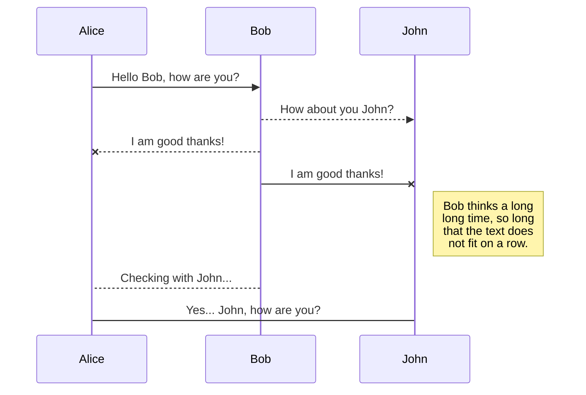
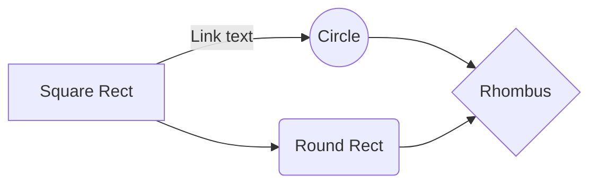
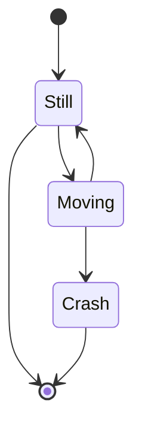
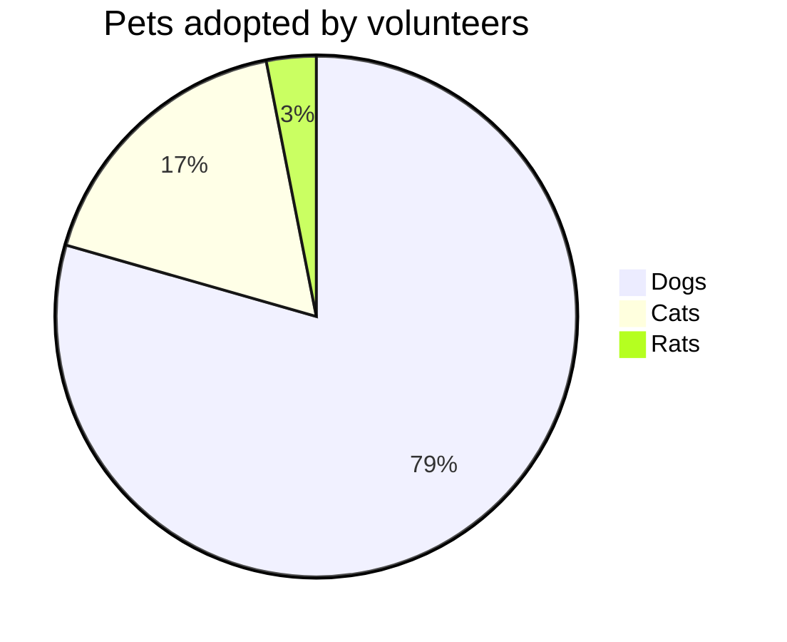
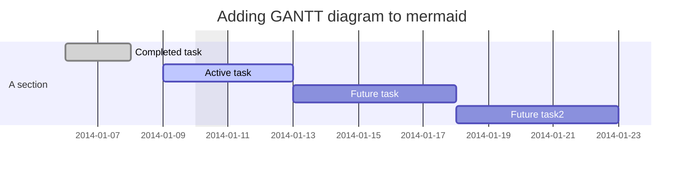

---

title: markdown参考案例
tags: markdown
category: markdown
date: 2018-09-22 22:50:00
---

## 字符效果和横线等

~~删除线~~
*斜体字*      _斜体字_
**粗体**  __粗体__
***粗斜体*** ___粗斜体___
==高亮==

上标：X~2~
下标：O^2^

**脚注**
Content  [^1]

[^1]: 我是脚注

<!-- more -->

**缩写(同HTML的abbr标签)**

*[HTML]: Hyper Text Markup Language
*[W3C]:  World Wide Web Consortium

The HTML specification is maintained by the W3C.

## 引用 Blockquotes

引用的行内混合 Blockquotes

> 引用：如果想要插入空白换行`即<br />标签`，在插入处先键入两个以上的空格然后回车即可，[普通链接](http://localhost/)。
> * 苹果
> * 香蕉

## 锚点与链接 Links

[普通链接](http://localhost/)

[普通链接带标题](http://localhost/ "普通链接带标题")

直接链接：<https://github.com>

[锚点链接][anchor-id]

[anchor-id]: http://www.this-anchor-link.com/

[mailto:test.test@gmail.com](mailto:test.test@gmail.com)

GFM a-tail link @pandao  邮箱地址自动链接 test.test@gmail.com  www@vip.qq.com

## 多语言代码高亮 Codes

### 行内代码 Inline code

执行命令：`npm install marked`

### 缩进风格

即缩进四个空格，也做为实现类似 `<pre>` 预格式化文本 ( Preformatted Text ) 的功能。

    <?php
        echo "Hello world!";
    ?>

预格式化文本：

    | First Header  | Second Header |
    | ------------- | ------------- |
    | Content Cell  | Content Cell  |
    | Content Cell  | Content Cell  |

### JS代码　

```javascript
function test() {
	console.log("Hello world!");
}

(function(){
    var box = function() {
        return box.fn.init();
    };

    box.prototype = box.fn = {
        init : function(){
            console.log('box.init()');

			return this;
        },

		add : function(str) {
			alert("add", str);

			return this;
		},

		remove : function(str) {
			alert("remove", str);

			return this;
		}
    };

    box.fn.init.prototype = box.fn;

    window.box =box;
})();

var testBox = box();
testBox.add("jQuery").remove("jQuery");
```

## 图片 Images


## 列表 Lists
### 无序列表（加号和嵌套）Unordered Lists (+/-/*)

+ 列表1 
+ 列表2
    + 列表二-1
    + 列表二-2
    + 列表二-3
      + level 3
      + list
+ 列表3
    - 列表一
    - 列表二

### 有序列表 Ordered Lists (1./2.)

1. 第一行
2. 第二行
3. 第三行

### GFM task list

- [x] GFM task list 1
- [x] GFM task list 2
- [ ] GFM task list 3
    - [ ] GFM task list 3-1
    - [ ] GFM task list 3-2
    - [ ] GFM task list 3-3
- [ ] GFM task list 4
    - [ ] GFM task list 4-1
    - [ ] GFM task list 4-2

## 绘制表格 Tables

| Left-Aligned  | Center Aligned  | Right Aligned |
|:------------- |:---------------:| -------------:|
| col 3 is      | some wordy text |        \$1600 |
| col 2 is      |    centered     |          \$12 |
| zebra stripes |    are neat     |           \$1 |

## 特殊符号 HTML Entities Codes

&copy; &  &uml; &trade; &iexcl; &pound;
&amp; &lt; &gt; &yen; &euro; &reg; &plusmn; &para; &sect; &brvbar; &macr; &laquo; &middot;

X&sup2; Y&sup3; &frac34; &frac14;  &times;  &divide;   &raquo;

18&ordm;C  &quot;  &apos;

## Emoji表情 :smiley:

- [x] :smiley: :joy:  @mentions, :star: #refs, [links](), **formatting**, and <del>tags</del> supported :cupid:;
- [x] list syntax required (any unordered or ordered list supported) :alarm_clock:;
- [x] :hearts: :yellow_heart: :gift_heart: this is a complete item :+1: :-1:;
- [ ] this is an incomplete item [test link](#) :pill: :syringe: @pandao :scroll: :file_folder: :open_file_folder:;
- [ ] :gear: this is an incomplete item :mag: :lock: :envelope: :pushpin: :paperclip: :pencil: :calendar: :date: ;
  - [ ] :zap: this is an incomplete item [test link](#) :tada: :bell: :hourglass_flowing_sand:;
  - [ ] :rabbit: :question: :exclamation: :bookmark: :books: :fire:  this is  :notes: :sunny: :mushroom: an incomplete item [test link](#);
  - [ ] :tea: :apple: :house: :cn: :arrow_forward: :ballot_box_with_check: :link: :fa-gear: :fa-gear: :zap:

## 科学公式 TeX(KaTeX)

$$
E=mc^2
$$

行内的公式$E=mc^2$行内的公式，行内的$E=mc^2$公式。

$$
x > y
$$

$$
(\sqrt{3x-1}+(1+x)^2)
$$

$$
\sin(\alpha)^{\theta}=\sum_{i=0}^{n}(x^i + \cos(f))
$$

## 拓展功能--自定义div

### detail折叠

::: details Python code
```python
import os

print("hello world")
```
:::

### hint块

::: hint info
hello world
:::

::: hint success
hello world
:::

::: hint warning
hello world
:::

::: hint danger
hello world
:::

### pannel块

::: pannel default 任务列表
- [x] 买一双运动鞋
- [ ] 背诵一篇作文
- [ ] 打一会篮球
:::

::: pannel success 任务列表
- [x] 买一双运动鞋
- [ ] 背诵一篇作文
- [ ] 打一会篮球
:::

::: pannel info 任务列表
- [x] 买一双运动鞋
- [ ] 背诵一篇作文
- [ ] 打一会篮球
:::

::: pannel warning 任务列表
- [x] 买一双运动鞋
- [ ] 背诵一篇作文
- [ ] 打一会篮球
:::

::: pannel danger 任务列表
- [x] 买一双运动鞋
- [ ] 背诵一篇作文
- [ ] 打一会篮球
:::

## 绘制流程图 

### Flowchart

流程图语法参考 https://github.com/adrai/flowchart.js

Markdown常用的元素有以下几种：
- start
- end
- operation
- condition
- inputoutput
- subroutine

```flow
st=>start: Start:>https://dxsm.github.io[blank]
e=>end:>https://dxsm.github.io
op1=>operation: My Operation
sub1=>subroutine: My Subroutine
cond=>condition: Yes
or No?:>https://dxsm.github.io
io=>inputoutput: catch something...
para=>parallel: parallel tasks

st->op1->cond
cond(yes)->io->e
cond(no)->para
para(path1, bottom)->sub1(right)->op1
para(path2, top)->op1
```

状态标记
Markdown会使用不同的颜色来标记状态，状态主要有以下几种：
- past
- current
- future
- approved
- rejected
- invalid

```flow
start=>start: 开始|past
requirementAnalysis=>operation: 需求分析|past
design=>operation: 软件设计|past
coding=>operation: 编码|past
selfTestingPased=>condition: 自测通过？|approved
debug=>operation: debug|invalid
submitTestingPased=>condition: 提测通过？|rejected
modifyBug=>operation: 修bug|current
deploy=>operation: 部署|future
end=>end: 结束|future

start->requirementAnalysis->design->coding->selfTestingPased
selfTestingPased(no)->debug(right)->selfTestingPased
selfTestingPased(yes)->submitTestingPased
submitTestingPased(yes)->deploy->end
submitTestingPased(no)->modifyBug(right)->submitTestingPased
```

### Sequence Diagram

语法参考 https://bramp.github.io/js-sequence-diagrams/
```sequence
Andrew->China: Says Hello
Note right of China: China thinks\nabout it
China-->Andrew: How are you?
Andrew->>China: I am good thanks!
```


### mermaid

mermaid非常强大，基本能够替代上面两种流程图，语法参考 https://mermaid-js.github.io/mermaid/#/flowchart

#### sequence diagram



#### flowchart



#### state diagram


#### pie chart



#### gantt



### 电路时序图
```wavedrom
{signal: [
  {name: 'clk', wave: 'P.....|...'},
  {name: 'dat', wave: 'x.345x|=.x', data: ['head', 'body', 'tail', 'data']},
  {name: 'req', wave: '0.1..0|1.0'},
  {},
  {name: 'ack', wave: '1.....|01.'},
]}
```

### 思维导图

```kminder
height: 200px
#主题
##论点1
###概述1
###概述2
##论点2
##论点3
##论点4
```

