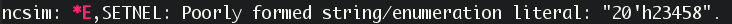
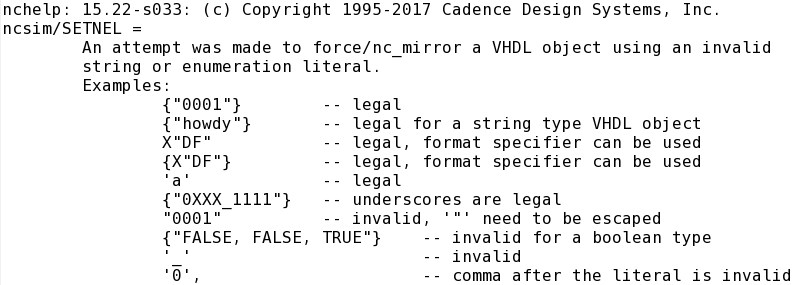

## force verilog内部信号

force verilog内部信号为某个值，可以这样写：

```verilog
initial begin  //verilog internal signal access
  force xxx.xxx.xxx = 16'hfffd;
  #500 release xxx.xxx.xxx;
end
```

## force vhdl内部信号

而对于vhdl内部信号，使用force是错误的，vhdl语言不允许这样做。但是EDA工具一般都会提供函数，例如cadence的ncsim，可以使用`$nc_force`和`nc_release`访问vhdl内部信号。
```verilog
initial begin //vhdl internal signal access
  $nc_force("xxx.xxx.xxx", "X'FFFD'");
  #500 $nc_release(xxx.xxx.xxx);
end
```

<!-- more -->

## cadence工具debug小技巧
使用cadence工具编译出错，看不懂error解释时，可以使用`nchelp`获取更详细的解释或解决办法。例如编译时出现如下错误：


可以在terminal敲入命令`nchelp ncsim SETNEL`得到详细帮助如下：

