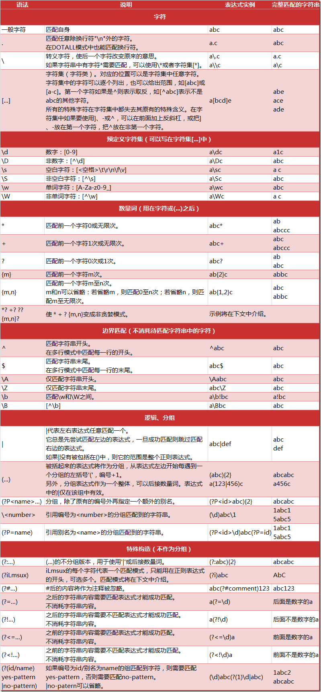

## 1. 为什么使用正则表达式？
典型的搜索和替换操作要求您提供与预期的搜索结果匹配的确切文本。虽然这种技术对于对静态文本执行简单搜索和替换任务可能已经足够了，但它缺乏灵活性，若采用这种方法搜索动态文本，即使不是不可能，至少也会变得很困难。

通过使用正则表达式，可以：
- **测试字符串内的模式。**
例如，可以测试输入字符串，以查看字符串内是否出现电话号码模式或信用卡号码模式。这称为数据验证。
- **替换文本**。
可以使用正则表达式来识别文档中的特定文本，完全删除该文本或者用其他文本替换它。
- **基于模式匹配从字符串中提取子字符串。**
可以查找文档内或输入域内特定的文本。

<!-- more -->

## 2. 匹配规则


## 3. re模块常用函数
### 3.1 re.match函数
re.match尝试从字符串的起始位置匹配一个模式，匹配成功则返回match对象；如果不是起始位置匹配成功的话，match()就返回none。

**函数语法：**
```python
re.match(pattern, string[, flags=0])
```

**函数参数说明：**
- pattern：匹配的正则表达式
- string：要匹配的字符串。
- flags：标志位，用于控制正则表达式的匹配方式，取值可以使用按位或运算符'|'表示同时生效
    * re.I(re.IGNORECASE)：忽略大小写
    * re.M(re.MULTILINE)：多行匹配，改变'^'和'$'的行为
    * re.S(re.DOTALL)：改变'.'的行为，使'.'匹配包括换行在内的所有字符
    * re.L(re.LOCALE)：做本地化识别（locale-aware）匹配，使预定字符类 \w \W \b \B \s \S 取决于当前区域设定
    * re.U(re.UNICODE)：根据Unicode字符集解析字符。这个标志影响 \w, \W, \b, \B.
    * re.X(re.VERBOSE)： 详细模式。这个模式下正则表达式可以是多行，忽略空白字符，并可以加入注释。

#### 3.1.1 返回值match对象
Match对象是一次匹配的结果，包含了很多关于此次匹配的信息，可以使用Match提供的可读属性或方法来获取这些信息。

**属性：**
* string: 匹配时使用的文本。
* re: 匹配时使用的Pattern对象。
* pos: 文本中正则表达式开始搜索的索引。值与Pattern.match()和Pattern.search()方法的同名参数相同。
* endpos: 文本中正则表达式结束搜索的索引。值与Pattern.match()和Pattern.search()方法的同名参数相同。
* lastindex: 最后一个被捕获的分组在文本中的索引。如果没有被捕获的分组，将为None。
* lastgroup: 最后一个被捕获的分组的别名。如果这个分组没有别名或者没有被捕获的分组，将为None。

**方法：**
* group([group1, …]):
获得一个或多个分组截获的字符串；**指定多个参数时将以元组形式返回**。group1可以使用编号也可以使用别名；编号0代表整个匹配的子串；不填写参数时，返回group(0)；没有截获字符串的组返回None；截获了多次的组返回最后一次截获的子串。
* groups([default]):
以元组形式返回全部分组截获的字符串。相当于调用group(1,2,…last)。default表示没有截获字符串的组以这个值替代，默认为None。
* groupdict([default]):
返回以有别名的组的别名为键、以该组截获的子串为值的字典，**没有别名的组不包含在内**。default含义同上。
* start([group]):
返回指定的组截获的子串在string中的起始索引（子串第一个字符的索引）。group默认值为0。
* end([group]):
返回指定的组截获的子串在string中的结束索引（子串最后一个字符的索引+1）。group默认值为0。
* span([group]):
返回(start(group), end(group))。
* expand(template):
将匹配到的分组代入template中然后返回。template中可以使用\id或\g<id>、\g<name>引用分组，**但不能使用编号0**。\id与\g<id>是等价的；但\10将被认为是第10个分组，如果你想表达\1之后是字符'0'，而不是分组10，只能使用\g<1>0。

#### 3.1.2 实例
```python
#!/usr/bin/env python

import re

str1 = """baidu.com
www.google.com
www.12306.cn"""

str2 = """www.baidu.com
www.google.com
www.12306.cn"""

pattern = r"(\w+)\.(\w+)\.(?P<domain>\w+)"

match = re.match(pattern, str1)
print(match)  #None

match = re.match(pattern, str2)
print(match)  #<_sre.SRE_Match object; span=(0, 13), match='www.baidu.com'>

if match:
  print(match.pos)          #0
  print(match.endpos)       #41
  print(match.group())      #www.baidu.com
  print(match.group(2))     #baidu
  print(match.group(2,3))   #('baidu', 'com')
  print(match.groups())     #('www', 'baidu', 'com')
  print(match.groupdict())  #{'domain': 'com'}
  print(match.span())       #(0, 13)
  print(match.span(3))      #(10, 13)
  print(match.start(3))     #10
  print(match.expand(r"\3 \1 \2 \g<domain>"))  #com www baidu com
else:
  print("No match!!!")
```

### 3.2 re.search函数
re.search扫描整个字符串并返回第一个成功的匹配。

**函数语法：**
```python
re.search(pattern, string[, flags=0])
```

**实例**
```python
#!/usr/bin/env python

import re

str1 = """baidu.com
www.google.com
www.12306.cn"""

str2 = """www.baidu.com
www.google.com
www.12306.cn"""

pattern = r"(\w+)\.(\w+)\.(?P<domain>\w+)"

match = re.search(pattern, str1)
print(match)  #<_sre.SRE_Match object; span=(10, 24), match='www.google.com'>

match = re.search(pattern, str2)
print(match)  #<_sre.SRE_Match object; span=(0, 13), match='www.baidu.com'>
```

### 3.3 re.findall函数
在字符串中找到正则表达式所匹配的所有子串，并返回一个列表，如果没有找到匹配的，则返回空列表。

**函数语法：**
```python
re.findall(pattern, string[, flags=0])
```

**实例**
```python
#!/usr/bin/env python

import re

text = """www.baidu.com
Site: www.google.com
www.12306.cn"""

pattern = r"(\w+)\.(\w+)\.(\w+)"
match = re.findall(pattern, text, re.M)
print(match)   #[('www', 'baidu', 'com'), ('www', 'google', 'com'), ('www', '12306', 'cn')]
```

### 3.4 re.finditer函数
搜索string，返回一个顺序访问每一个匹配结果（Match对象）的迭代器
**函数语法：**
```python
re.finditer(pattern, string[, flags=0])
```

**实例**
```python
#!/usr/bin/env python

import re

for m in re.finditer(r"\d+",'one1two2three3four4'):
  print(m.group(), end=" ")   #1 2 3 4
```

### 3.5 re.sub函数
使用repl替换string中每一个匹配的子串后返回替换后的字符串。
当repl是一个字符串时，可以使用\id或\g<id>、\g<name>引用分组，但不能使用编号0。
当repl是一个函数时，**这个函数应当只接受一个参数（Match对象）**，并返回一个字符串用于替换（返回的字符串中不能再引用分组）。
count用于指定最多替换次数，不指定时全部替换。

**函数语法：**
```python
re.sub(pattern, repl, string[, count])
```

**实例**
```python
#!/usr/bin/env python

import re

text = 'i say, hello world!'
pattern = r'(\w+) (\w+)'

print(re.sub(pattern, r'\2 \1', text))   #say i, world hello!

def func(m):
  return m.group(1).title() + ' ' + m.group(2).title()

print(re.sub(pattern, func, text))       #I Say, Hello World!
print(re.sub(pattern, func, text, 1))    #I Say, hello world!
```

### 3.6 re.subn函数
返回 (sub(repl, string[, count]), 替换次数)。

**函数语法：**
```python
re.subn(pattern, repl, string[, count])
```

**实例**
```python
#!/usr/bin/env python

import re

text = 'i say, hello world!'
pattern = r'(\w+) (\w+)'

print(re.sub(pattern, r'\2 \1', text))   #('say i, world hello!', 2)

def func(m):
    return m.group(1).title() + ' ' + m.group(2).title()

print(re.sub(pattern, func, text))       #('I Say, Hello World!', 2)
print(re.sub(pattern, func, text, 1))    #('I Say, hello world!', 1)
```

### 3.7 re.split函数
按照能够匹配的子串将string分割后返回列表。maxsplit用于指定最大分割次数，不指定将全部分割。

**函数语法：**
```python
re.split(pattern, string[, maxsplit]):
```

**实例**
```python
#!/usr/bin/env python

import re

text = 'one1two2three3four4'
pattern = r"\d+"

print(re.split(pattern, text))      #['one', 'two', 'three', 'four', '']
print(re.split(pattern, text, 2))   #['one', 'two', 'three3four4']
```

## 4. Pattern对象
**re.compile函数构造：**
```python
re.compile(strPattern[, flag])
```

**方法：**
* ```match(string[, pos[, endpos]])```：功能等同于re.match函数。不同的是可以指定匹配的起始与终止下标，pos和endpos的默认值分别为0和len(string)，re.match()无法指定这两个参数。
* ```search(string[, pos[, endpos]])```：同上
* ```findall(string[, pos[, endpos]])```：同上
* ```finditer(string[, pos[, endpos]])```：同上
* ```sub(repl, string[, count])```
* ```subn(repl, string[, count])```
* ```split(string[, maxsplit])```

**实例**
```python
#!/usr/bin/env python

import re

s = "Steven is 17 years old."
p = re.compile(r"\d+")

print(p.match(s))     #None
print(p.match(s,10))  #<_sre.SRE_Match object; span=(10, 12), match='17'>
```

## 5. 匹配方式--flags
### 5.1 re.M
实例：替换多行的行首note为warning
```python
#!/usr/bin/env python

import re

text = """note: Meeting will begin at 8:00.
note: Please take your notebook.
note: Meeting will end at 10:00. (note: turn off the light)
"""

p = re.compile(r"^note")
print((p.sub("warning",text)))  #only the first line has substitute

p = re.compile(r"^note", re.M)
print((p.sub("warning",text)))  #sub all line
```

### 5.2 re.S
改变'.'符号的行为，使其能够匹配换行符
```python
#!/usr/bin/env python

import re

text = """
parameter MODE       = 1 ,
          DIN_WIDTH  = 32,
          DOUT_WIDTH = 24;
"""

p = re.compile(r"parameter(.*);")
m = p.search(text)
print(m)  #None

p = re.compile(r"parameter\s+(.*);", re.S)
m = p.search(text)
print(m.group(1))
```

## 6. 贪婪模式
Python里数量词默认是贪婪的，总是尝试匹配尽可能多的字符；非贪婪的则相反，总是尝试匹配尽可能少的字符。例如：正则表达式"ab*"如果用于查找"abbbc"，将找到"abbb"。而如果使用非贪婪的数量词"ab*?"，将找到"a"。
```python
#!/usr/bin/env python

import re

text = "abcaxc"

m = re.match(r"ab.*c",text)
print(m.group())    #abcaxc

m = re.match(r"ab.*?c",text)
print(m.group())    #abc
```
