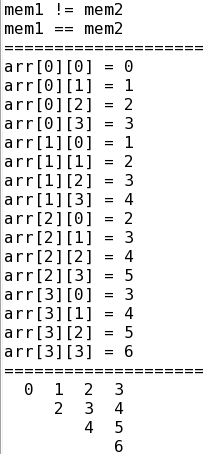

# systemverilog基础

## 1. 内建数据类型
四状态：reg, wire, logic, integer, time(默认值为X)
双状态：bit, int, byte, shortint, longint, real(默认值为0)
有符号数：int, byte, shortint, longint, integer(可以使用unsigned申明为无符号数)

:fa-heart: **`$isunknown`操作符:**
作用：使用`$isunknown`操作符，可以在表达式的任意位出现X或Z时返回1

```verilog{.line-numbers}
//test_isunknown.sv
module test_isunknown();

logic [3:0] din;

initial begin
  din = 4'b1001;  //Unknown not found!
  din = 4'b1x01;  //Unknown is detected!
  din = 4'b1z01;  //Unknown is detected!
  if($isunknown(din))
    $display("Unknown is detected!");
  else
    $display("Unknown not found!");
end

endmodule
```

## 2. 数组
### 2.1 数组初始化、比较、 复制、循环
循环使用for或foreach

```verilog{.line-numbers}
//test_array.sv
module test_array();

// array initial
int mem1[4] = '{1,2,3,4};
int mem2[4] = '{4{8}};    //'{8,8,8,8}
//int mem3[5] = '{9,8,default:1};  //'{9,8,1,1,1} my eda tool does not support
int arr[4][4] = '{
  '{0,1,2,3},
  '{1,2,3,4},
  '{2,3,4,5},
  '{3,4,5,6}
};

initial begin
  //array compare
  $display("mem1 %s mem2", (mem1==mem2) ? "==" : "!=");   //mem1 != mem2
  //array copy
  mem2 = mem1;
  $display("mem1 %s mem2", (mem1==mem2) ? "==" : "!=");   //mem1 == mem2

  //array loop
  $display({20{"="}}); //seperate line
  foreach(arr[i][j])
    $display("arr[%0d][%0d] = %0d", i, j, arr[i][j]);

  $display({20{"="}}); //seperate line
  foreach(arr[i]) begin
    foreach(arr[,j])
      if(j>=i)
        $write("%3d",arr[i][j]);
      else
        $write("%3s","");
    $display;
  end
end

endmodule
```
运行结果如下：


### 2.2 动态数组
* 分配空间new[]
* 分配空间并复制new\[\](arr)
* 释放空间arr.delete()
* 当数组(动态或定宽)复制给一个动态数组时，会调用构造函数new[]分配空间并复制数据
* $size(arr)返回数组宽度

```verilog{.line-numbers}
module dyn_array();

// declare and initial
int dyn[];
int arr[3] = '{9,7,8};

initial begin
  //分配空间
  dyn = new[5];
  foreach(dyn[i])
    dyn[i] = i;  //'{1,2,3,4,5}

  //分配空间并复制
  dyn = new[10](dyn); //'{1,2,3,4,5,0,0,0,0,0}
  dyn = arr; //'{9,7,8}

  //重新分配空间，旧值不复存在
  dyn = new[3]; //'{0,0,0}

  //释放空间
  dyn.delete();
  $display($size(dyn));  //0
end

endmodule
```

### 2.3 队列
* 声明q[\$]
* \$表示队列索引的最大值或最小值，[$:2]代表[0:2]，[1:$]代表[1:$size(q)-1]，**不是所有仿真器都支持\$表示最小值**
* q.insert(idx,value), 在idx之前插入元素或者队列，**不是所有仿真器都支持插入队列**
* q.delete(idx), 删除第idx个元素
* q.push_front(value), 在队列前面插入元素，等价于q={value,q}
* q.push_back(value), 在队列末尾插入元素，等价于q={q,value}
* q.pop_front, 从队列前面移出元素，等价于j=q[0]; q=q[1:$]
* q.pop_back, 从队列末尾移出元素，等价于j=q[$]; q=q[0:$-1]
* q.delete(), 清空队列，等价于q={}
* 可以把定宽或动态数组复制给队列
* 队列遍历也可以使用for和foreach

```verilog{.line-numbers}
module queue();

// declare and initial
int q[$] = {0,2,5};
int q1[$] = {3,4};
int arr[4] = '{9,8,7,6};
int j = 1;

initial begin
  q.insert(1,j); //{0,1,2,5}
  //q.insert(3,q1);  //{0,1,2,3,4,5}, my eda tool does not support insert queue
  q = {q[0:2],q1,q[$]}; //{0,1,2,3,4,5}, use concat instead of insert function
  q.delete(1); //{0,2,3,4,5}

  q.push_front(6); //{6,0,2,3,4,5}
  q.push_back(8);  //{6,0,2,3,4,5,8}
  j = q.pop_front; //{0,2,3,4,5,8}, j=6
  j = q.pop_back;  //{0,2,3,4,5}, j=8

  q = arr; //{9,8,7,6}, copy array to queue

  q.delete(); //empty queue
  $display("%0d", $size(q)); //0
end

endmodule
```
