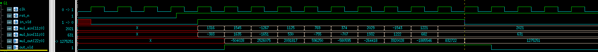

# systemverilog接口以及搭建测试环境

* 接口信号必须使用非阻塞赋值来驱动
* modport将信号分组并指定方向
* clocking时钟块用于控制同步信号的时序

testbench注意事项：
* `$exit`用于结束程序块，`$finish`用于结束仿真
* 时钟产生不应该放在program程序块中，会引起信号的竞争，而应该放在module中
* 例化时如果端口名字和数据类型一致，例化时可以用.*(隐式端口连接)

## DUT代码
以简单的乘法器为例写testbench
```verilog{.line-numbers}
//mul.v
module mul(
  input             clk,
  input             rst_n,
  input             in_vld,
  input      [11:0] mul_ain,
  input      [11:0] mul_bin,
  output reg [22:0] mul_out,
  output reg        out_vld
);

always @(posedge clk)
  if(in_vld)
    mul_out <= $signed(mul_ain) * $signed(mul_bin);

always @(posedge clk,negedge rst_n)
  if(!rst_n)
    out_vld <= 1'b0;
  else
    out_vld <= in_vld;

endmodule
```

## interface代码
```verilog{.line-numbers}
//mul_if.sv
interface mul_if(input bit clk);

logic        clk;
logic        rst_n;
logic        in_vld;
logic [11:0] mul_ain;
logic [11:0] mul_bin;
logic [22:0] mul_out;
logic        out_vld;

//define clock block
clocking cb(@posedge clk);
  output in_vld;
  output mul_ain;
  output mul_bin;
endclocking

//Driver port direction
modport DRV(
  clocking cb,
  output rst_n
);

//DUT port direction
modport DUT(
  input rst_n,
  input in_vld,
  input mul_ain,
  input mul_bin,
  output mul_out,
  output out_vld
);

endinterface
```

## Driver代码
```verilog{.line-numbers}
//driver.sv
program driver(mul_if.DRV mulif);

initial begin
  //reset value
  mulif.rst_n <= 1'b0;
  mulif.cb.in_vld <= 1'b0;

  //release reset
  #37 mulif.rst_n <= 1'b1;
  repeat(10) begin
    ##1 mulif.cb.in_vld <= 1'b1; //drive data @(posedge clk), ##1 means delay 1 clock
    mulif.cb.mul_ain <= $random;
    mulif.cb.mul_bin <= $random;
  end
  ##1 mulif.cb.in_vld <= 1'b0;
  repeat(5) @mulif.cb;   //wait posedge clk
  $finish;
end

endprogram
```

## tb_top代码
```verilog{.line-numbers}
//tb_top.sv
module tb_top();

bit clk;
always #5 clk = ~clk;

mul_if mulif(clk);
driver u_drv(mulif);

mul u_mul(
  .clk      (clk),
  .rst_n    (mulif.DUT.rst_n),
  .in_vld   (mulif.DUT.in_vld),
  .mul_ain  (mulif.DUT.mul_ain),
  .mul_bin  (mulif.DUT.mul_bin),
  .mul_out  (mulif.DUT.mul_out),
  .out_vld  (mulif.DUT.out_vld)
)

initial begin
  $fsdbDumpfile("wave.fsdb");
  $fsdbDumpvars(0);
end

endmodule
```

## 仿真波形

