CPF, UPF, IEEE1801 这些名称的渊源可参阅《一文读懂power intent的历史：从CPF/UPF到IEEE1801》，1801的内容其实十分简明，概括来说一个完整的1801 文件可以分成三部分[^1]：
* 区域划分: 上帝的归上帝，凯撒的归凯撒，包括supply set 跟power domain 两个东西。
* 策略定义: 没有清规戒律，何以服众，包括isolation, level shifter, retention, power switch 四种策略。
* 模式定义: 宿命就是划定的圈，听天由命也是宿命，只有power state.

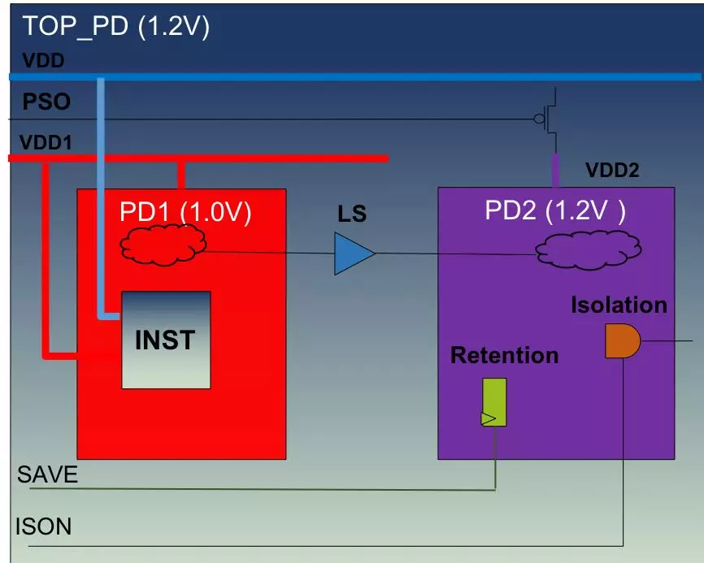
<!-- more -->

在实际项目中，power domain 的划分有时候会极其复杂，会有多个1801 文件相互调用，但再复杂的设计都是上述三部分内容的集合，在面对复杂设计时，简单有效的办法是：一张图 + 一张表。
* 一张图：将power domain 及boundary 的关系画出来，就可以十分明确地知道需要定义多少个power domain, 每个power domain 有哪些供电电压，哪些power domain 之间需要isolation 或level shifter, 哪些power domain 需要power switch 跟retention cell. 有了图之后，剩下的事情就是用1801 的命令进行描述。
* 一张表：用表来描述power state, 先将每一个supply set 的power state 列出，再将系统的power mode 列出。

## 1. 区域划分

Supply set：从1801 开始引入supply set 的概念，supply set 很像C++ 里的"类"，它将所有相关的supply nets "封装"起来，一个supply set 包含某个instance 或power domain 所有的supply nets。1801 的标准一直在更新，现在最新的应该是IEEE1801-2015, supply set 的定义如下图：
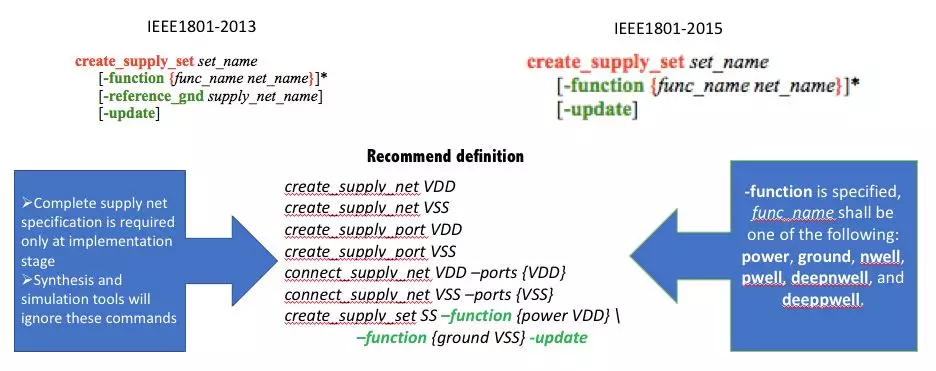

Power Domain：在逻辑上看，power domain是一组instance 的集合，集合中所有的instance 共用相同的supply set. 从物理上看，一个power domain 对应一个voltage area, 这个area 内部所有的std cell 用同一组电源和地。
需要特别说明一下 -available_supply 这个option,  默认在"本power domain" 或 "父power domain" 区域定义的supply set 都可供该power domain 所用，但实际项目中，并不能也不需要将所有的power 都拉到该区域，所以需要给工具指明该power domain 需要哪些supply set, 此时就需要用到这个 option:
* 如果没有指定-available_supply，则在"本power domain" 或 "父power domain" 区域定义的supply set 都可为该power domain 所用；
* 如果指定-available_supply 且其值为空字符串，如 {} , 那只有-supply 指定的supply set 才可以为本power domain 所用；
* 如果用-available_supply 指定了某个具体的 supply set, 则该power domain 除了可以用由-supply 指定的supply set 也可以用由该option 指定的supply set.
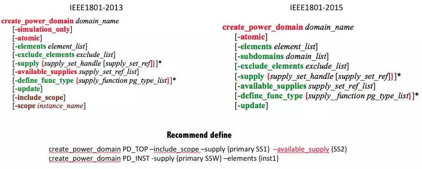

Supply set in Power domain：每创建一个power domain 都会自动创建三个supply sets:
* Primary：定义该power domain 中所有instance 的primary power 和 primary ground。
* Default retention: 用于retention cells.
* Default isolation：用于isolation cells

也同C++ 中对象的访问类似，可以用 "句柄" 来访问power domain 的supply set, 如："DomainName.Supply_set"。创建power domain时自动创建的supply sets 需要同电路中的supply net 正确关联起来方可。有如下两种方式：
* Style1:
```tcl
create_supply_set SS1 -function {power VDD}
create_power_domain PD1 –supply {primary SS1}
```

* Style2:
```tcl
create_power_domain PD1
create_supply_set SS1 -function {power VDD}
associate_supply_set SS1 –handle PD1.primary
```

## 2. 策略定义
### 2.1 Isolation
Isolation：当一条net 的driver 在shutoff power domain 而load 在more on power domain 时，该net 在跨power domain 时就需要插入isolation cell. 以保证在shutoff power domain 断电时，more on power domain 的输入被钳位到一个固定电压值而不是一个不定态。Isolation cell 在逻辑功能上可能是『二输入与』也可能是『二输入或』，其中一个输入是控制信号，用于掉电后把输出拉高或拉低，另一个输入为功能信号。通常有双电源跟单电源两种isolation cell, 双电源isolaiton cell 可以放入shutoff power domain, 一组电源接shutoff power 另一组电源接backup 电源；而单电源isolation cell 只能放入more on power domain 或more more on parents power domain.
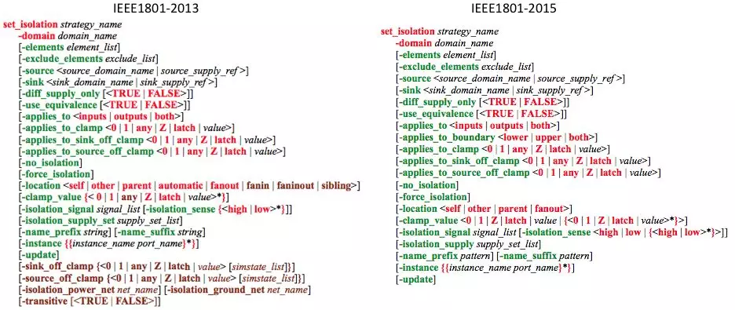

不同的工具都在跟着IEEE 1801 标准的更新不断改进，并不是所有的工具都支持所有的option, 其实大部分isolation 的定义都不需要所有的option。在UPF1.0 中需要用set_isolation + set_isolation_control 两条命令来定义一条isolation stratage, 即使是到1801 时代，在很长一段时间，有些工具依然需要用两条命令来定义。
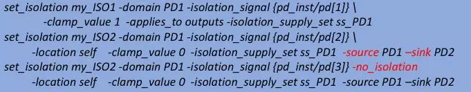

**定义哪里需要插入 isolation：**
* 从"一张图" 开始，确定需要插入isolation 的interface net.
* 用下面的option 来定义：
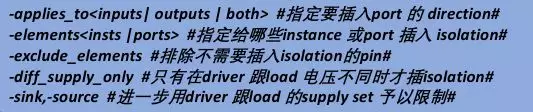

**定义如何插入 Isolation：**
* 用如下option 定义：
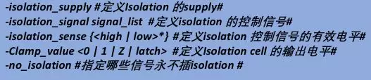

### 2.2 Level Shifter
Level shifters：当一条net 的driver 跟load 在由不同电压驱动的power domain 时，该net 在跨power domain 时就需要插入level shifter cell，以确保输入信号的电平在合法范围内。通常level shifter cell 有三种：从低到高、从高到低、既能低到高也能高到低。在逻辑功能上 level shifter cell 比isolation cell 简单，就是一个buffer，但是需要两组power supply, 输入power supply 对应于driver 的supply, 输出power supply 对应于load 的supply。
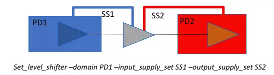

理论上讲，只要net 跨越不同电压驱动的power domain 就需要插入level shifter cell, 但是如果一根信号是从高电压区域到低电压区域，且『高低电压差』在低电压区cell 可忍受范围内，则可以省去该level shifter cell. 但是通常从低电压到高电压，则一定要插入level shifter，否则可能由于电压低于load cell 翻转电压导致功能错误，而且会由于管子不能完全关断会造成持续短路电流。
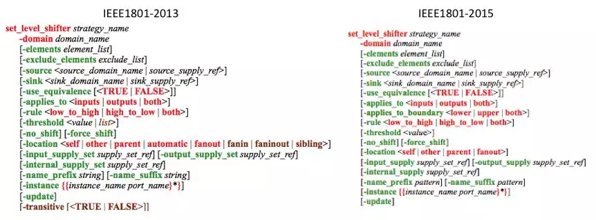

level shifter rule 的定义也比isolation rule 要简单。
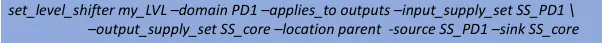

**定义哪里需要插入 level shifter:**
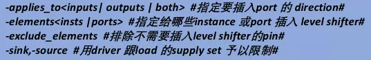

**定义如何插入 level shifter：**
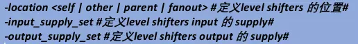

### 2.3 Retention
Retention：shut off domain 中有些寄存器非常重要，即便是掉电后其内容也需要被保留住，以保证上电后相关逻辑有个正确的起点，在低功耗设计中这些寄存器会用retention 寄存器来替换，retention 寄存器有多种结构，差别之处主要在控制信号的数目及控制方式，内部结构相差并不大。相比于普通的寄存器Rentention 寄存器内部多了一个有独立电源的latch, 这个独立电源会连到always on supply 上，当主电源掉电后，该Latch 会将寄存器掉电前最后的状态锁存住，当主电源恢复后，再将该Latch 锁存的状态读回。常见的retention cell 有如下几种，此处不展开描述，会另辟章节介绍这些低功耗cell。
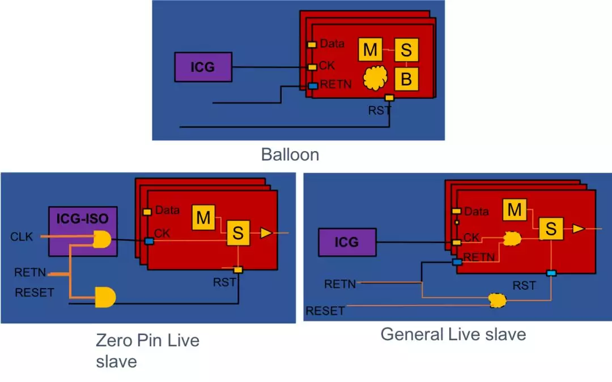

Retention rule 比其他几个rule 要复杂一些，在定义retention rule 之前需要确认几点：
* 去lib 或lib 的doc 中确认要用到的retention cell 的控制信号是哪些，及相应的有效电平。
* 跟设计人员确认shut off domain 中哪些寄存器需要做retention.
* 确认retention cell 的backup supply是谁。
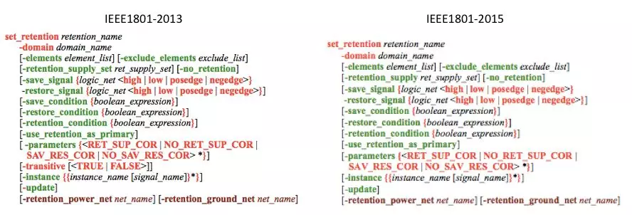

哪些寄存器需要retention：
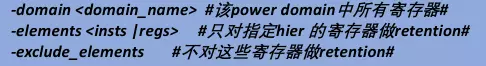

指定retention cell 的backup supply：
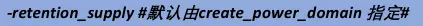

指定retention cell 的控制信号：
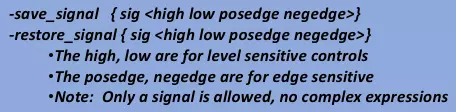

指定用那种retention cell：
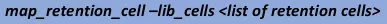

### 2.4 Power Switch
Power Switches：用于控制shut off power domain 电源的开关，power switch 用于控制power net 故跟power plan 相关，在实现时需要精细考虑以尽量减小其造成的IR-drop. 不像其他low power cell 通常需要在综合时插入, power switch cell 是在P&R 工具中插入的。通常power switch cell 有Coarse Grain 和Fine Grain 两种，更常用的是Coarse Grain, 根据切断电流通路的位置它又分Header Switch  跟Footer Switch 两中。Fine Grain 指对每个STD cell 分别关断，这要求每个STD cell 自带一个Switch 管子且有一个控制pin, 在该Domain 不工作时将supply 断开。
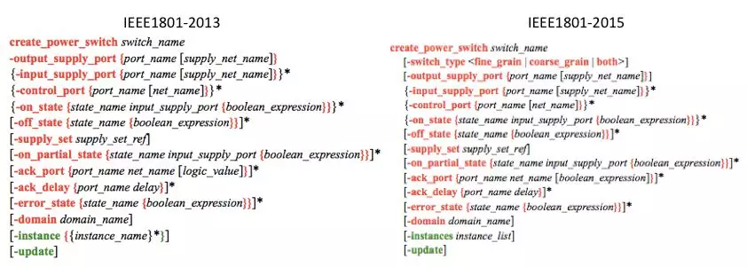

常见的Power Switch cell 有一个控制信号或两个控制信号用-control_port 来指定，用-on_state 来定义控制逻辑，如"与或非" 。 -ack_port 所指定的信号用于表示输出电压是否已稳定，这个信号通常用于其他power switch 的输入或状态机的控制。
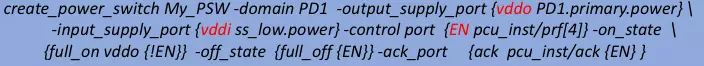

### 2.5 Map to specfic cells
在大多数情况下，都需要指定某个isolation 或 level shifter stratage 可用哪些特定的lib cell, 在UPF 1.0 中会用如下命令予以指定：
```tcl
map_isolation_cell -lib_cells <cells list>
map_level_shifter_cell -lib_cells <cells list>
```

在很多用IEEE 1801 描写的UPF 文件中，亦会用这两条命令来指定，一方面是由于工具端更新不及时，另一方面源于用户使用习惯。 在IEEE1801 中定义了新命令：use_interface_cell. 这条命令可以针对某条具体的strategy 来指定。
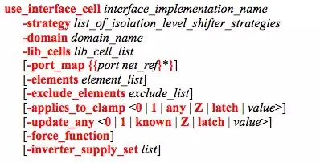

如果一条net 即需要插入isolation cell 也需要插入 level shifter cell 通常会用到一种带enable pin 的level shifter cell, 这类cell 有两类：一类叫enabled level shifter cell 另一种叫combo cells, 即将isolation cell 跟 level shifter cell 组合到一起的cell, 这两类cell 在library 中的定义不同，用CPF 描述时也不同，用IEEE 1801定义时，需要分别定义isolation rule 跟 level shifter rule, 然后用use_interface_cell 将两条rule 指定到组合的cell 上即可。
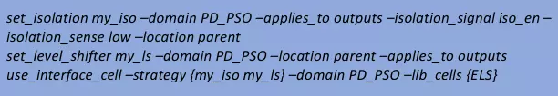

## 3. 模式定义
Power State：power state 是power intent 的"状态机"，用于定义设计中每个power domain 的供电状况，如哪些power domain 开启，哪些power domain 关断，哪些power domain 可工作于多个电压。CPF, UPF, 1801 都有各自定义power state的命令。
* CPF: 用create_power_mode 来定义，在CPF 中power state 通常被称为power mode.
* UPF: 用add_port_state + create_pst + add_pst 来定义，比较繁琐。
* 1801: 虽然可以用upf 的命令来定义，但是强烈推荐用命令add_power_state 来定义。
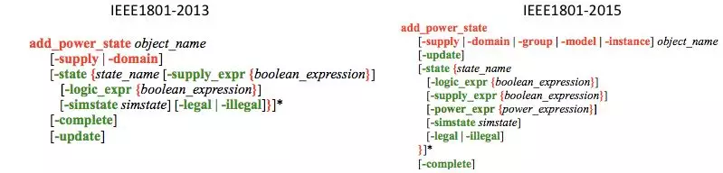

如同RTL 写状态机需要画状态转移图一样，在定义power state 之前最好列一张"状态表"，尤其对于复杂设计而言十分必要。如下图，该设计有两个power domain:
* PDon: 常开电压域，工作电压1.08V，对应的supply set 是VDD + VSS.
* PD1: 可关断电压域, 工作电压是0.9V, 对应的supply set 是power switch 的输入VDDm + VSS; 跟power switch 的输出VDDau + VSS。
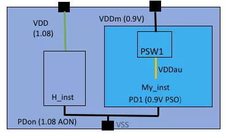

根据power domain 的划分及描述，可以列一张如下的表，列出该设计所有可能的power state 及每个power state 对应supply set 的工作电压。
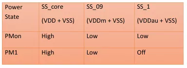

1801 的power state 定义由supply set level power state 和 system level power state 两级构成。
* supply set level power state: 用add_power_state + -supply_expr 定义每个supply set 的工作电压。虽然并不是必须要明确定义supply set 的power state, 但强烈推荐予以明确定义，保证良好的继承性及可读性，所见即所得。
* system level power state: 用add_power_state + -logic_expr 定义不同supply set 间的交互。

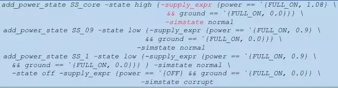
supply set level power state 的定义需要注意几点：
* -supply_expr 中只能包含该supply set 对应的net.
* 在supply_expr 中可用逻辑与"&&" 表示不同supply net的状态。
* -simstate 用于simulation, "normal" 对应于ON state, "corrupt" 对应于OFF state. 实现工具自动忽略该option.
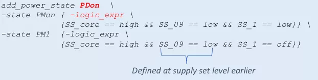

system level power state 的定义需要注意几点：
* add_power_state 后跟的object_name，C 跟S 的工具有所不同，对于C家的工具这个object_name 可以是已定义的任何一个power domain 的名字，如示例中的"PDon"；而对于S 家的工具目前还不支持用power domain 做object_name, 需要用命令 create_power_state_group 定义一个state group, 用这个state group 做object_name.
* 需要在每个-logic_expr 中将所有的supply set 的状态明确给出。
* 在system level power state 中不要指定-simstate.

[^1]: 整理自陌上风骑驴看IC
