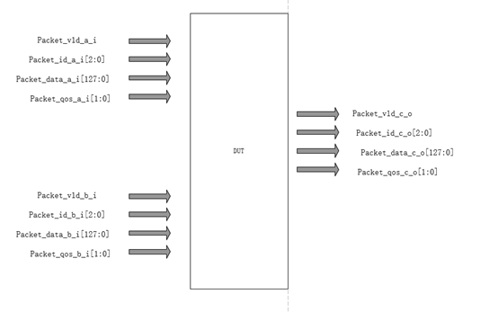
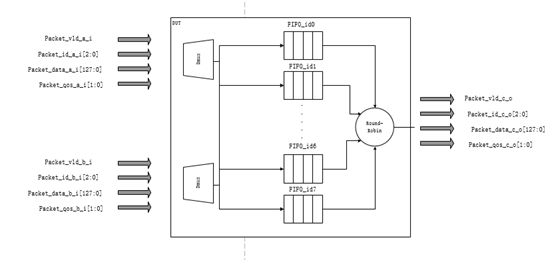
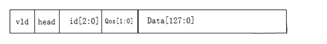
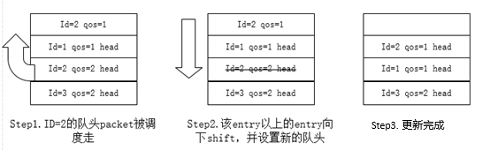
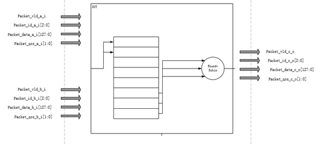

首先来看一下场景，这是一个在大多数设计中都会遇到的数据包调度问题。有A,B两个输入通道，向数据调度模块DUT输入数据。该调度模块DUT有一个输出通道C。A,B和DUT，DUT和C都是通过简单的握手传输数据。

两个输入通道都有数据包输入，可以同时输入。数据包以packet为单位，每个packet为128bit。不同的数据包有不同的id，id是4个bit。A和B通道不会同时输入同ID的数据。每个packet带有2bit的qos，qos越高，可以理解为该id的packet优先级相对于其他id的packet优先级越高。输出通道没有反压，只要有数据就可以出去。输入通道接受反压。数据输出的条件是，同id的packet要保序输出，不同id的packet，优先级较高的需要尽量先输出。

<!--more-->

 

从这个场景的几个条件，我们可以大概规划出这个DUT需要具备什么样的功能。首先，从两个通道输入和一个通道输出，输入通道可以同时有效这点可以看出来这是一个输入输出流量不匹配的模块，必须要有缓存。因为没有具体的输入场景描述，单纯从输入输出口数量来进行判断，这个缓存的buffer深度可以设成任意无限大，因为极限场景就是每拍a和b都同时有1个packet输入，因为c只能有1个packet输出，每拍都会有1个packet残留。但因为有反压机制，当残留packet到达缓存上限的时候就可以反压端口，因此一个合适的buffer深度足矣。

 

除了缓存数据，这个DUT还有一个重要的功能就是调度不同id的packet，使其尽量按照qos从大到小的顺序输出。这个输出特点决定了缓存深度不能设置的太小。设置的太小，可同时进行比较的packet数量太少，qos按顺序输出的范围太小。只有将更多的packet储存下来进行qos比较，才能在一个合理的时间范围内保证降序输出qos。为了简单起见，这里buffer深度设置为12（该深度与A,B输入的实际流量，或者说链路利用率强相关，这里不多加讨论）。

 

有了足够深度的buffer来缓存packet，我们需要将packet按id进行分类，因为同id的packet需要保序输出，然后对不同id的packet进行调度。这里涉及到两个关键点，保序和调度。因为输入的同id的packet本身是保序的，因此为了让输出保序，很容易就想到了经典的First In First Out这样的FIFO结构。又因为不同id的packet之间要进行调度，很容易就想到每个id的packet设置一个独立的FIFO，然后在每个FIFO出口处进行调度。至于调度，有几种不同的算法，本文也不多加讨论，简而言之就是选出最高qos的可调度packet，然后通过round-robin或者sp等调度算法进行调度。

 

这样一来，一个粗略的方案便形成了。通过对每个id设立不同的FIFO来进行缓存packet，在每个id的FIFO出口进行仲裁调度，输出高qos的packet。因为输入的id是3个bit，所以最多有7种不同的id，需要设置7个FIFO，简单的微架构图如下：

这个方案从功能角度来说是可以满足要求的。但是就是有点占资源。因为在这个方案中对每个id都设置了对应的FIFO来解决保序+调度的需求，所以FIFO数量等于id的所有可能数量。如果id的位宽小，packet的数据位宽小，那还可以接受，但如果id有12bit呢？packet的数据位宽有1024bit呢？那么岂不是需要4K个1024bit的FIFO，深度还需要设置呢，这么一想便觉得此方案有其局限性。要知道寄存器怎么来说都是理论上的面积大户，一般能少则少。

 

在上图架构中我们之所以将不同的ID设置一个单独的FIFO初衷只是因为这种方式最直观地将所有的id区分开，相信大多数人对于此场景的第一反应都是类似的架构。通过输入的ID“静态”地将数据打入对应ID的FIFO，“静态”地隔离开了不同ID的packet，便于后续的仲裁调度。但是再仔细一想，我们为此将所有可能的ID全部设置了单独的FIFO，但并不是每个ID在某一个特定时间段内都会出现，也就是说在进行仲裁调度的时候，很可能某些FIFO是没有东西的。但是因为这些FIFO只能被相应ID的packet占用，别的ID的packet就算自己的FIFO被占用满了，也没法使用，那么这些个FIFO岂不是浪费了？如果这些FIFO可以被别的ID使用，是不是更好？

 

这里便可以引入我们标题里的“共享buffer”概念。这里的共享指的是不同ID packet之间的共享。我们试图使用一个“共享buffer”来缓存在某一个大流量时刻所有ID的packet，并从中选择每个ID的队头packet进行仲裁调度。这个buffer为了与分ID设置的FIFO达到相同的功能，势必需要储存除了packet data以外更多的信息。这里主要有几点。

 

1. 为了区分不同ID的packet，需要将每个packet的对应ID也存到buffer的相应entry。
2. 同ID的packet之间可能间插了别的ID的packet，因此该共享buffer的读指针不能按一般的FIFO来设置。事实上，因为我们只需要对每个ID对应队列的队头packet进行仲裁调度，我们只需要知道每个ID的队头是哪个位置便可，每个ID队列里其他的packet处于哪个位置我们并不在乎。因此，需要1个bit来标识为对应ID的队头。
3. 因为该共享buffer的读写不同于普通FIFO，为了便于迅速找出所有有效的entry，设置一个vld bit来表征。

 

因此这个共享buffer的储存数据结构大致如下：

Head bit的更新主要是以下两个条件：

1. 当新的packet写入时，需要遍历当前共享buffer所有的有效entry，若没有与自己id匹配的entry，将head设置为1‘b1。

2. 当有packet被仲裁调度调度走之后，需要做一个数据移位，将晚于被调度走的buffer entry的所有entry向下移位，保证所有有效的buffer是连续的，然后从0位置开始自下往上寻找第一个与被调走的packet同id的entry，将其设置为新的head。

   

这样一来，在调度的时候，只需要找到所有head bit为1‘b1的有效entry，便和每个ID都设置独立FIFO，对所有FIFO队头进行调度有一样的效果了。当然，在该共享buffer的写端口，需要保证和正常FIFO一样按序写入。只不过这里因为搜索队头的策略，该buffer不支持“套圈”读写，写指针写到buffer顶部时便无法再写入。至于该共享buffer的深度，设置成与单个ID FIFO一样的深度便可保证大部分情况下与分ID FIFO有相同效果（当然这取决于实际流量，可能需要适当增加一些）。

 

该共享buffer的微架构大致如下：

 

以上便用一个组合逻辑多一些的架构替代了一个寄存器非常多的架构。这个微架构的优势在于灵活，在大数据宽度，多id的情况下可以尽可能地节省面积。这里用到的思想其实就是“分时复用“。同一个buffer entry在不同的时候可以被不同ID的packet所占用。当然实现起来更为复杂，毕竟引入了一些新的状态位需要维护和更新。还有一些具体的时序问题，以及设计细节没有在本文中一一尽述。但是这样的缩减面积的思想其实是可以被参考借鉴的，希望可以对大家有所帮助。