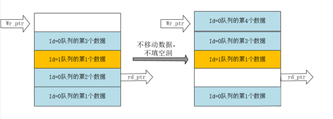
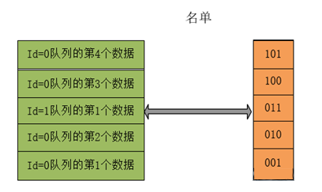
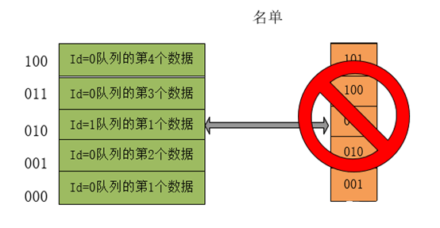

我们知道在芯片设计中，降低动态功耗的方法有很多种。比如clock gating，power gating等。今天想介绍一个通过减小移动数据位宽来降低动态功耗的方法。

动态功耗的来源是信号的传播，翻转。clock gating通过减少时钟信号的翻转，降低了寄存器clk pin本身的功耗，并且通过寄存器的特性，间接减少了Q pin的翻转，从而降低了数据链路的功耗。而power gating更绝，直接将电路断电，更无翻转可言。这两种方式本质上都是在电路或者某些寄存器没有数据更新需求的时候减少无谓的信号翻转，以此来降低功耗。而减小传播数据的位宽，可以在有数据更新需求的时候减少动态功耗。毕竟传递的数据少了，需要翻转的信号自然也少了。但是这样做需要考虑上减小数据位宽所带来的一点额外逻辑开销造成的功耗。不过大多数时候都能得到正收益，特别是当数据位宽较大的时候。

<!--more-->

在之前的文章《芯片设计小实例——共享buffer》中，我们尝试用一个共享buffer实现了不同id数据流的仲裁调度。在这个微架构中，需要对多个entry的数据同时做移位，也就是一个移位寄存器，以此来满足我们搜索各id队列的队头的策略：

在上图中，每次调度读走一个数据，需要对该数据以上所有的数据做向下移位，（比如读走entry_1的数据，entry_2和entry_3的数据要向下移位），然后进行下一次的调度。这个方法其实是会产生较大动态功耗的，特别是当数据位宽很大，需要移位的数据很多的时候。

那么有没有办法避免这样的大数据位宽移动呢？答案是肯定的。为了找到这个办法，我们需要先了解数据移动的目的是什么。在这个例子中，**之所以要对被读走数据以上的数据做集体向下移位，是为了保证从entry_0向上搜索的过程中所有id通道的数据是保序并且没有空洞的，因为我们默认了这个buffer从下往上的顺序对应着每个id 队列的从前往后的顺序（因为我们是自下而上有序地写入）。**

 

如果不做这个移动，那么被读走的entry将形成一个数据空洞。当然在这个数据空洞被新的数据填充之前，这个保序规则都没有被打破，**但很明显这样就大大降低了entry的利用率**，因为在空洞以上所有数据都被读走之前，该空洞都无法被写入：

而如果有新的数据填入这个空洞，**那么保序规则将被打破，除非被读走数据本身就处于buffer最顶部**，如下图所示，id=0的第4个数据插在了第1个和第3个数据中间，对于id=0的队列，从下往上的数据序列变为1->4->3，保序规则被打破：

因此这里最好的办法就是对数据做向下移位，既可以充分利用每个entry，又可以维持队列顺序：

通过观察可以发现，这个移位在算法里是必要的，**但是这个移位与数据本身是什么，具体有多少bit并无直接的联系。我们移1024bit是这样移动，移512bit是这样移动，甚至移3个bit照样是一样的移动规则。**这就不禁让人思考，是否可以直接用3bit来代替1024bit的数据？或者说，给每个进入buffer的1024bit的数据起个别名？比如做一个名单：

在这个名单中，每个数据对应一个3bit的代号（假设这个buffer只有5个深度），这些代号各不相同，因此他们可以一一对应地指代不同的数据。然后之前的移动数据，就可以变成简单地移动这些代号：

如上图所示，维护一个新的“代号移动buffer”，**在每次新写入一个数据的时候，将其代号写入这个“代号移动buffer”，就可以保持数据不变，将数据的移动转换为代号的移动，不管是多少bit的数据，都只移动3bit**。而数据则可以原封不动地停留在buffer中（甚至数据也没必要从下往上按序写入，只要代号从下往上按序写入即可）。然后在每个代号被移动出buffer的时候，再将其转换为对应的数据读出，这样一来，移位寄存器的功耗就大大地降低了！

 

这么做的代价有很多，比如需要维护一个“名单”，就要额外开辟一个3x5bit的名单列表，如果buffer深度较大，为了保证名单里的代号互不冲突，名单的位宽也要加大，这也会占用很多寄存器。这里可以再做一个优化，**我们发现所谓的名单只要能保证在这个buffer里每个entry都不一样就可以了，而每个buffer本身就有这么个“名单”，无需另外维护，那就是buffer的index：**

直接用index来作为每个数据的代号，在数据出buffer的时候还可以直接拿来索引真正的数据，一举两得。既省去了名单的寄存器，又减少了名单和数据转换的逻辑（只需要通过index选择读数据），真是太好了!

 

从这个小例子我们可以看到，合适巧妙地对数据进行“瘦身”，特别是类似移位寄存器这种需要大量进行移动的数据，可以有效地降低功耗，并且很多开销也不算大。使用这种方法的条件，是数据的移动规则与数据本身没有关系，并且数据有单独的固定空间存放，读写简单（最好是寄存器读写）。希望对大家有所帮助。