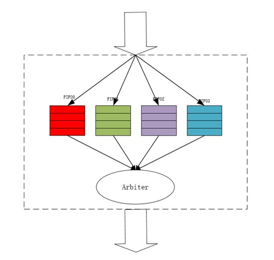
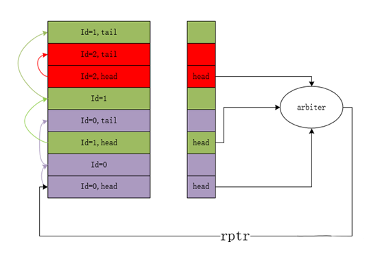
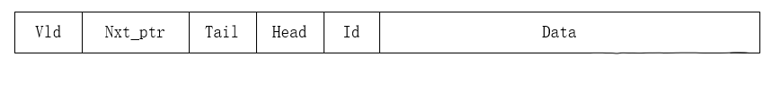
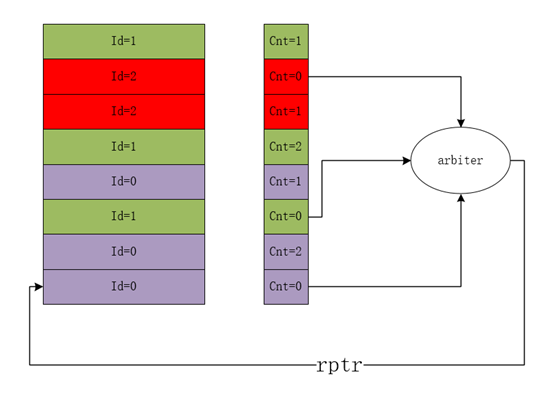
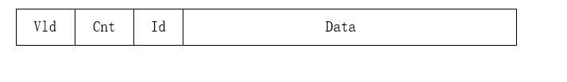
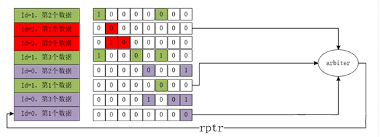
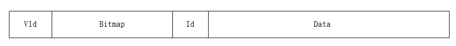
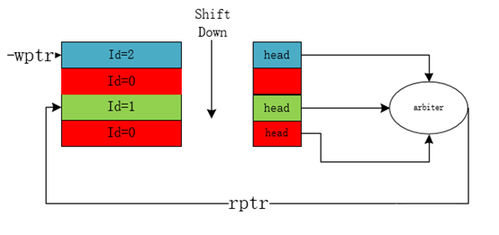
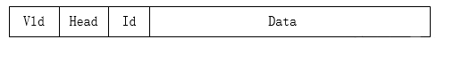

今天想分享几种流保序策略。保序问题在不同的应用领域都会遇到，毕竟硬件电路本质上是需要很多数据流传输的。各种协议的接口，处理器的数据处理，指令处理等都离不开对应数据有序的传输。

如果只有一条数据流，可以直接使用一个FIFO保序。如果是多数据流，多个读写口，可以分不同ID使用不同FIFO保序。**今天想讨论的是多数据流混合场景下只有1个读口和1个写口的保序。不同的数据流有对应不同的ID**，大致有以下5种不同的保序策略。

<!--more-->

## 1. 不同ID使用不同FIFO分别保序

每个FIFO只需要储存数据就可以，各自维护一套读写指针，储存数据结构简单，只需要存下数据，无需其他信息。

优点：简单直观，时序好，易实现

缺点：静态配置，不够灵活，当ID多或者FIFO深度大的时候很占面积

## 2.不同ID使用同一共享”Buffer”，使用链表保序：

使用链表保序也是一种比较常见的做法。需要额外记录队头队尾的位置信息，以及下一个位置的指针信息，其数据结构如下：

基本读写规则和更新规则如下：

1. 数据随意插空写入buffer

2. 每次写入时将当前entry置为队尾，tail=1’b1

3. 每次写入时搜索整个buffer中是否有同id的entry，若无同id，则head=1‘b1，若有，则搜索当前同id的队尾，将当前写入的位置信息更新到队尾所在entry的nxt_ptr

4. 每个队列的head参与仲裁读出

5. 每次读出时将相应队头的nxt_ptr所指的entry的head置为1’b1

   

优点：灵活配置，寄存器资源相对较少，并可被充分利用，特别适用于队列深度未知的场景。

缺点：更新复杂，时序较差，特别是每次读出一个队头更新下一个队头的时候，需要连续两次访问不同entry的buffer并做一个写操作，时序路径很长。

## 3.不同ID使用同一共享”Buffer”，使用队列计数器保序：

这种方法通过记录每个entry在当前buffer中处于所在队列的第几个位置来表征顺序。需要额外有一个计数器储存空间，其数据结构如下：

基本读写规则和更新规则如下：

1. 数据随意插空写入buffer
2. 每次写入时计算出当前buffer中同ID的entry个数，作为cnt记录
3. 所有cnt=0的entry参与读出仲裁
4. 每次读出一个数据，相同ID的所有entry的cnt均减1

优点：灵活配置，寄存器资源相对较少，并可被充分利用, 更新规则较为简单。

缺点：输入时序较差，需要做多bit加法。另外如果每个队列的深度未知，则此方案不可行，因为无法确定cnt的位宽。

## 4.不同ID使用同一共享”Buffer”，使用bitmap保序：

如上图所示，每个entry都保存了一个“bit map”，用来记录当前buffer所有位置的同id entry信息。其储存数据结构如下：

基本读写规则和更新规则如下：

1. 数据随意插空写入buffer
2. 每次写入时遍历buffer所有同id的entry，若有，则将该位置（可能有多个）对应的bit map置为1
3. Bit map为全0的位置可参与仲裁读出
4. 每次读出更新所有同id的bit map，将相应位置置为0

优点：灵活配置，更新规则较为简单，时序相对较好。

缺点：若buffer深度较大，bit map面积太大。

## 5.不同ID使用同一共享”FIFO”，通过顺序写入+数据移位保序：

这种结构除了数据以外，每个entry需要额外存下vld，id和表示队列对头的head信息，数据结构如下：

优点：灵活配置，寄存器资源相对较少，并可被充分利用 

缺点：因为要做数据移位，可能有较大功耗

以上便是几种不同的保序策略，希望对大家有所帮助。至于什么时候选择哪一种策略，则取决于实际场景和各种环节约束，需要因地制宜。